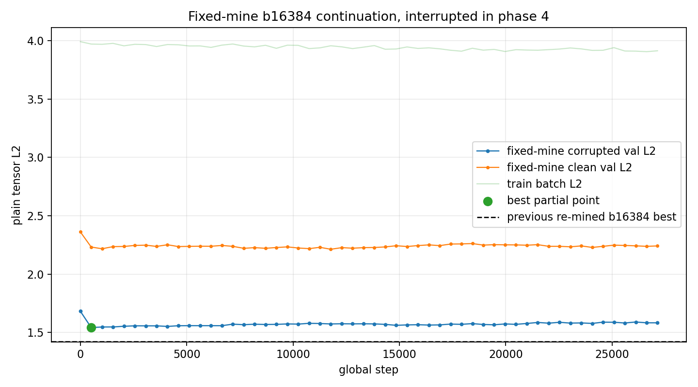
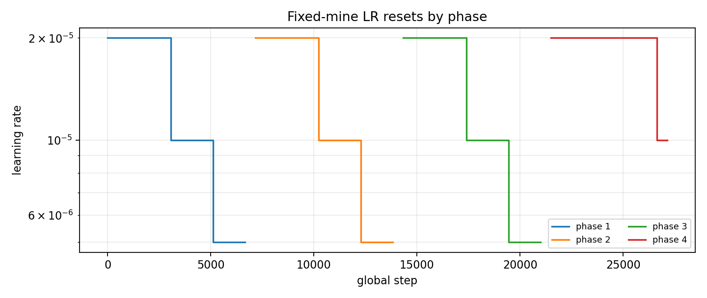
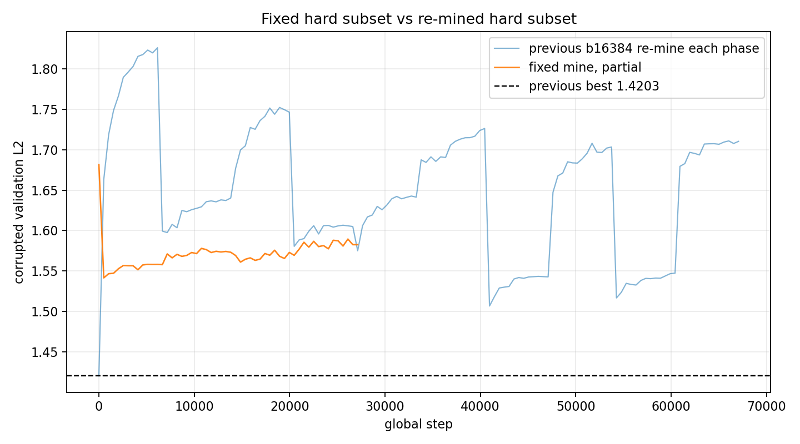

# Phase 2 Simple Voxel AE z8 b16384 Fixed-Mine Continuation

This run tested the requested change: use the final state from the previous batch-16384 training and do **not** reselect the worst 10% each phase. The trainer mined the hard subset once in phase 1, then reused the same selected rows while resetting LR at phase boundaries.

Start checkpoint:

`local_data/experiments/phase2_simple_voxel_ae_z8_b16384_halfcorr_continue_v001/checkpoint_latest.pt`

## Status

The run was interrupted by a CUDA launch timeout during phase 4, so this is a partial report. The useful part is that the fixed-mine behavior is verified and the partial curve is long enough to compare against the re-mined run.

| item | value |
|---|---:|
| batch size | 16384 |
| hard fraction | 0.10 |
| selected rows | 75,777 |
| subset policy | mine once, reuse every phase |
| last logged step | 27,136 |
| best partial validation L2 | 1.541490 |
| best partial step | 512 |
| last logged validation L2 | 1.582548 |

## Convergence

## Mining Behavior

| phase | reused selection | selected rows | scan runtime s | selected corrupted L2 mean |
|---:|---:|---:|---:|---:|
| 1 | False | 75,777 | 1.504 | 3.992483 |
| 2 | True | 75,777 | 0.000 | 3.992483 |
| 3 | True | 75,777 | 0.000 | 3.992483 |
| 4 | True | 75,777 | 0.000 | 3.992483 |

## Completed Phase Summary

| phase | steps | best step | phase best validation L2 | final LR | stop reason |
|---:|---:|---:|---:|---:|---|
| 1 | 6,656 | 512 | 1.541490 | 2.50e-06 | lr_below_5e-06 |
| 2 | 7,168 | 7,680 | 1.566254 | 2.50e-06 | lr_below_5e-06 |
| 3 | 7,168 | 14,848 | 1.561002 | 2.50e-06 | lr_below_5e-06 |

## Interpretation

Fixed mining behaved more smoothly than reselecting every phase. Starting from the literal final previous checkpoint, validation recovered from `1.6817` down to `1.5415`, but it did not return to the earlier best loaded-checkpoint territory of `1.4203`.

So the fixed-subset change is directionally saner, but this partial run does not show a new best model. If we continue this idea, I would restart from the previous **best** checkpoint, not the final overtrained `checkpoint_latest.pt`, and keep the fixed subset policy.

## Files

- Partial best checkpoint: `local_data/experiments/phase2_simple_voxel_ae_z8_b16384_halfcorr_fixedmine_continue_v001/checkpoint_best.pt`
- Latest interrupted checkpoint: `local_data/experiments/phase2_simple_voxel_ae_z8_b16384_halfcorr_fixedmine_continue_v001/checkpoint_latest.pt`
- Metrics: `local_data/experiments/phase2_simple_voxel_ae_z8_b16384_halfcorr_fixedmine_continue_v001/metrics.csv`
- Mining summary: `local_data/experiments/phase2_simple_voxel_ae_z8_b16384_halfcorr_fixedmine_continue_v001/mining_summary.csv`
