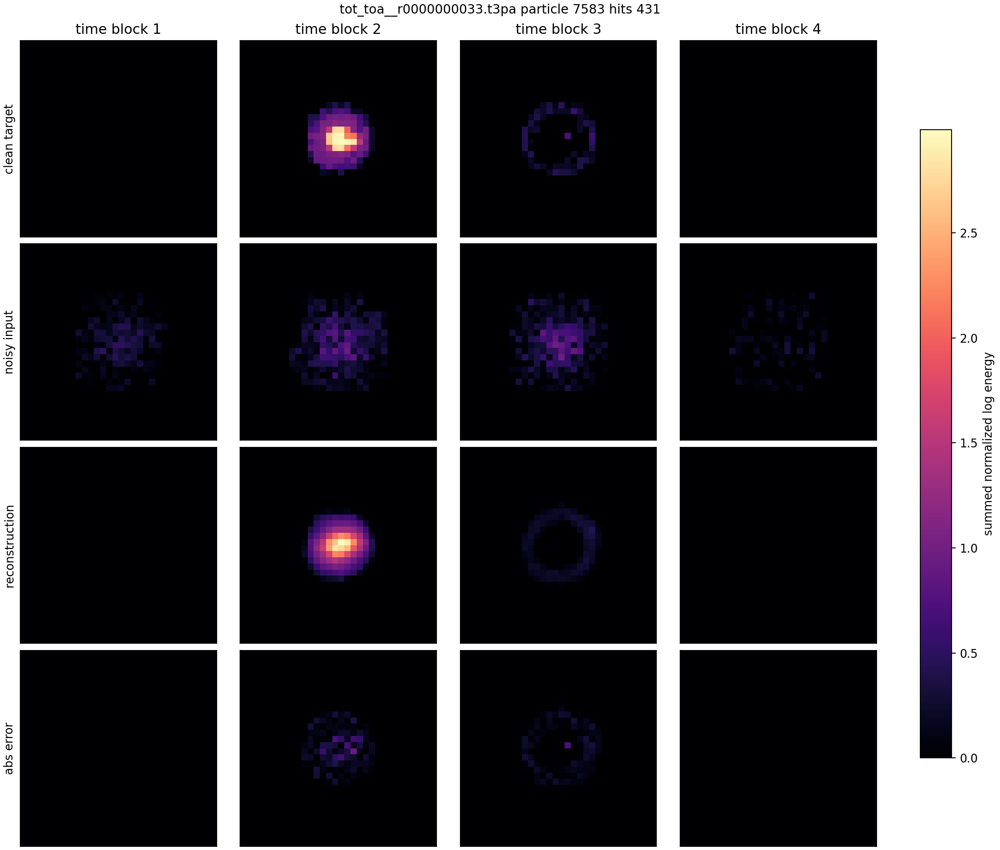
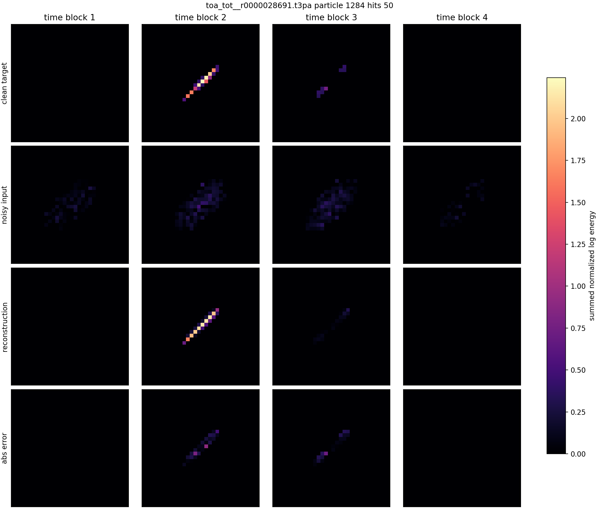
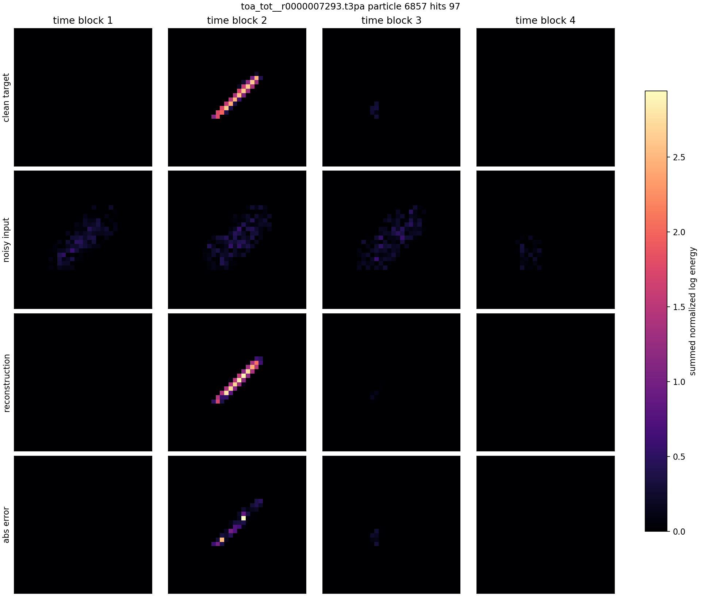
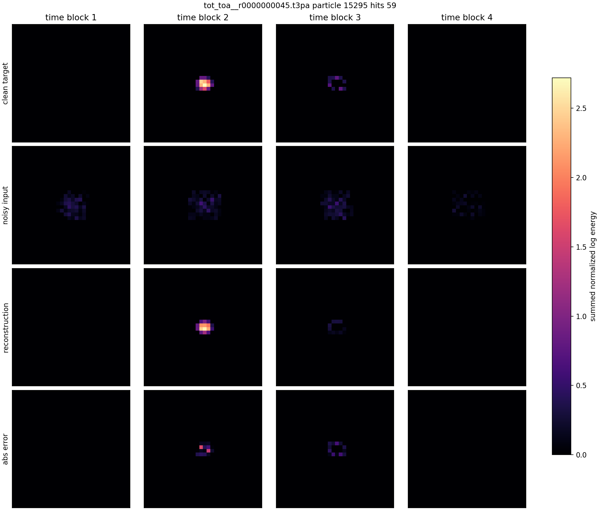

# Simple z8 Voxel Autoencoder Gallery

Model input is the fixed high-corruption tensor used during training. This model has no explicit transform layer and only an 8D direct latent bottleneck.

| # | source | particle | hits | energy clean/noisy/recon | relative L2 clean | image |
|---:|---|---:|---:|---:|---:|---|
| 1 | `F08/tot_toa__r0000000033.t3pa` | 7583 | 431 | 128.751/151.883/128.153 | 0.2313 | [png](../../../assets/phase2_simple_voxel_z8_b4096_continue/gallery_v001/simple_z8_example_01.png) |
| 2 | `D05/tot_toa__r0000000039.t3pa` | 8867 | 86 | 36.759/48.933/33.685 | 0.3607 | [png](../../../assets/phase2_simple_voxel_z8_b4096_continue/gallery_v001/simple_z8_example_02.png) |
| 3 | `F08/tot_toa__r0000000033.t3pa` | 5075 | 53 | 24.913/32.940/24.941 | 0.5818 | [png](../../../assets/phase2_simple_voxel_z8_b4096_continue/gallery_v001/simple_z8_example_03.png) |
| 4 | `13_tue_proton_daily_batch/toa_tot__r0000028691.t3pa` | 1284 | 50 | 24.459/38.056/24.455 | 0.3342 | [png](../../../assets/phase2_simple_voxel_z8_b4096_continue/gallery_v001/simple_z8_example_04.png) |
| 5 | `08_thu_proton_daily_batch/toa_tot__r0000007293.t3pa` | 6857 | 97 | 48.082/65.768/48.084 | 0.4504 | [png](../../../assets/phase2_simple_voxel_z8_b4096_continue/gallery_v001/simple_z8_example_05.png) |
| 6 | `F08/tot_toa__r0000000033.t3pa` | 43762 | 51 | 23.601/28.969/18.731 | 0.4208 | [png](../../../assets/phase2_simple_voxel_z8_b4096_continue/gallery_v001/simple_z8_example_06.png) |
| 7 | `D05/tot_toa__r0000000045.t3pa` | 15295 | 59 | 27.508/36.174/23.191 | 0.3518 | [png](../../../assets/phase2_simple_voxel_z8_b4096_continue/gallery_v001/simple_z8_example_07.png) |
| 8 | `F08/tot_toa__r0000000033.t3pa` | 4402 | 57 | 25.182/36.184/27.472 | 0.3135 | [png](../../../assets/phase2_simple_voxel_z8_b4096_continue/gallery_v001/simple_z8_example_08.png) |
| 9 | `D05/tot_toa__r0000000039.t3pa` | 39380 | 80 | 36.463/51.032/37.900 | 0.3921 | [png](../../../assets/phase2_simple_voxel_z8_b4096_continue/gallery_v001/simple_z8_example_09.png) |
| 10 | `08_thu_proton_daily_batch/toa_tot__r0000007293.t3pa` | 9079 | 72 | 35.842/52.014/35.721 | 0.2805 | [png](../../../assets/phase2_simple_voxel_z8_b4096_continue/gallery_v001/simple_z8_example_10.png) |

## Example 1

## Example 2

## Example 3

## Example 4

## Example 5

## Example 6

## Example 7

## Example 8

## Example 9

## Example 10

