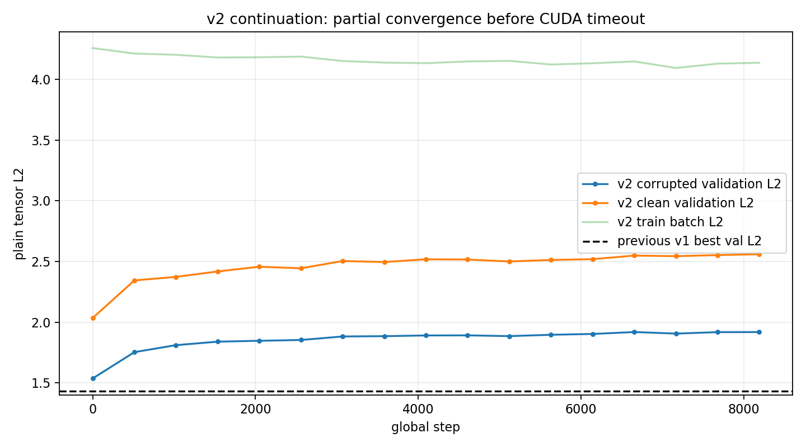
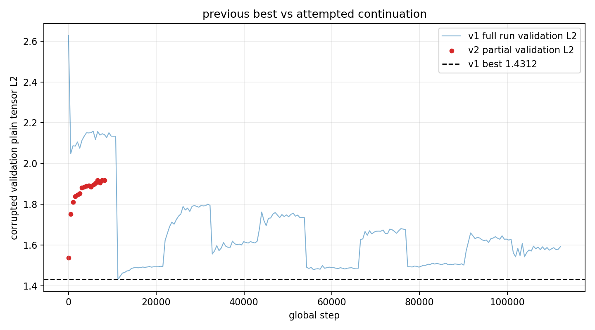
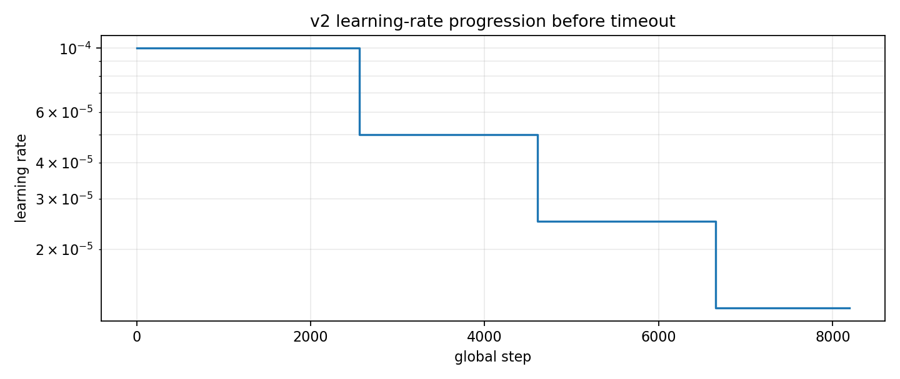

# Phase 2 Simple Voxel AE z8 b4096 Half-Corruption Continuation v2

This run continued from the previous best half-corruption checkpoint:

`local_data/experiments/phase2_simple_voxel_ae_z8_b4096_halfcorr_continue_v001/checkpoint.pt`

It used the same simple no-transform voxel autoencoder (`z_shape=8`, no explicit transform), the compressed `8 x 32 x 32` voxel tensor, batch size `4096`, and half corruption:

| setting | value |
|---|---:|
| blur kernel | 5 |
| blur mix | 0.5 |
| noise std | 0.02 |
| voxel dropout | 0.04 |
| LR start | 1e-4 |
| loss | plain tensor L2 |

## Status

The rerun did **not** finish cleanly. CUDA timed out during phase 1 at step `8192`. The partial run also did not improve over the checkpoint it started from.

| run | best step | best corrupted validation L2 | last logged validation L2 | note |
|---|---:|---:|---:|---|
| previous v1 half-corruption run | 11264 | 1.431248 | 1.591969 | current usable best |
| attempted v2 continuation | 1 | 1.536251 | 1.918023 | interrupted, worse than v1 |

The v2 `checkpoint_best.pt` exists, but it is from step `1` and is worse than the v1 checkpoint. I would keep using v1 as the current best model.

## Convergence

## What Happened

The hard-mining pass scanned 757,765 training particles and selected 75,777 (10.0%) with mean selected corrupted L2 4.2460.

The first v2 validation point was already above the previous best (`1.5363` vs `1.4312`), and subsequent validation points drifted upward. That means this continuation was not merely stopped early; it was going the wrong way for the selected validation metric.

## Recommendation

Use this checkpoint as current best:

`local_data/experiments/phase2_simple_voxel_ae_z8_b4096_halfcorr_continue_v001/checkpoint.pt`

For another continuation, I would either lower the learning rate to `2e-5` from the start, or switch to a clean/low-corruption fine-tune with a smaller step budget. Repeating the same `1e-4` continuation from v1 is likely to damage the solution again.
