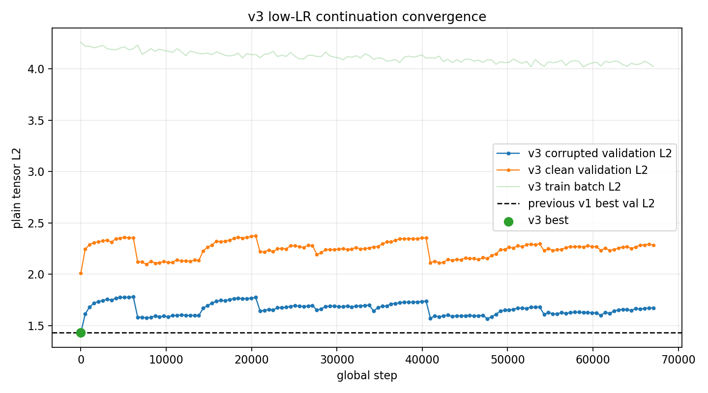
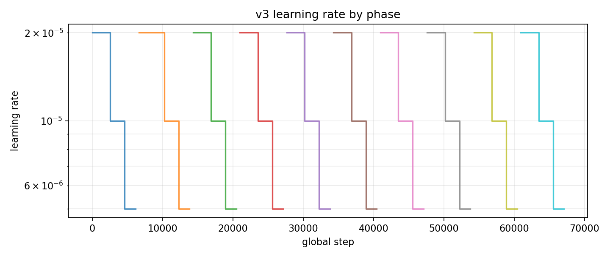
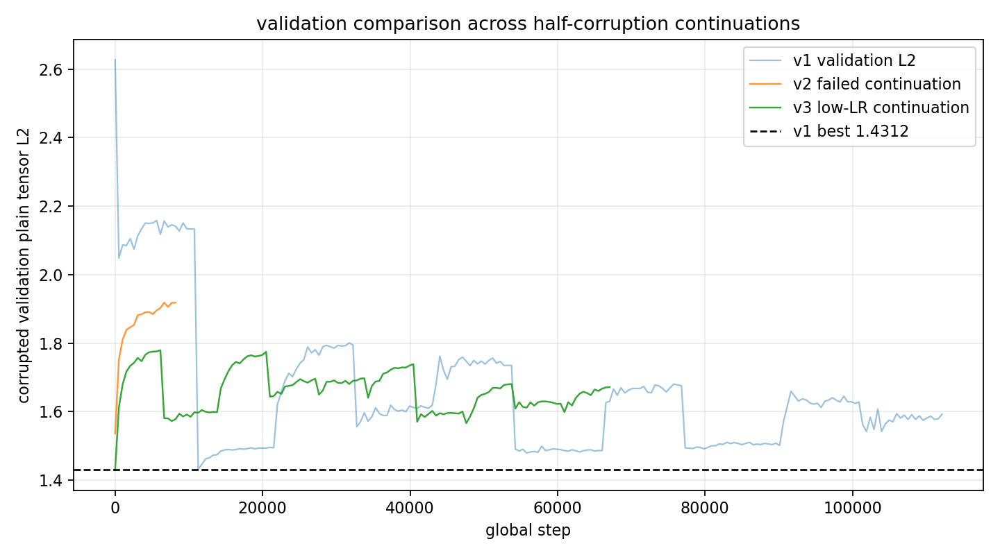
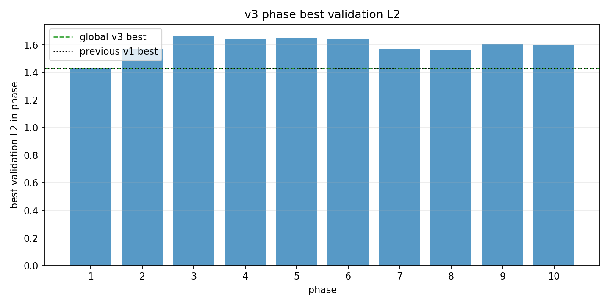

# Phase 2 Simple Voxel AE z8 b4096 Half-Corruption v3 Low-LR Continuation

This is the completed rerun requested after the previous half-corruption training. It starts from the current best checkpoint from v1:

`local_data/experiments/phase2_simple_voxel_ae_z8_b4096_halfcorr_continue_v001/checkpoint.pt`

The model is still the simple no-transform compressed voxel autoencoder:

| item | value |
|---|---:|
| voxel tensor | `8 x 32 x 32` |
| shape latent | 8 |
| explicit transform latent | 0 |
| batch size | 4096 |
| hidden dim | 768 |
| patch hidden / embed | 192 / 32 |
| loss | plain tensor L2 |
| corruption | blur mix 0.5, noise std 0.02, dropout 0.04 |
| LR start per phase | 2e-5 |

## Result

The run finished all 10 phases. The global best was at step `1` with corrupted validation L2 `1.429873`. That is numerically a little lower than v1's recorded best validation L2 `1.431248`, but it happened immediately after loading the checkpoint, before additional training had time to help.

| checkpoint | corrupted test L2 | clean test L2 | corrupted test energy rel L1 | note |
|---|---:|---:|---:|---|
| v1 half-corruption best | 0.966094 | 1.421219 | 0.152436 | previous current best |
| v3 low-LR continuation | 0.963547 | 1.425051 | 0.149332 | slightly better corrupted test L2 |

The practical interpretation is: the v1 checkpoint remains essentially the solution; this v3 run confirms that extra hard-mined L2 training does not improve the model after loading. The saved v3 `checkpoint.pt` is valid and has marginally better corrupted test L2, but it should not be read as a new learned phase, because its best point is step 1.

## Convergence

## Phase Summary

| phase | steps | best step | best validation L2 | final LR | stop reason |
|---:|---:|---:|---:|---:|---|
| 1 | 6,144 | 1 | 1.429873 | 2.50e-06 | lr_below_5e-06 |
| 2 | 7,680 | 7,680 | 1.572084 | 2.50e-06 | lr_below_5e-06 |
| 3 | 6,656 | 14,336 | 1.667964 | 2.50e-06 | lr_below_5e-06 |
| 4 | 6,656 | 20,992 | 1.643617 | 2.50e-06 | lr_below_5e-06 |
| 5 | 6,656 | 27,648 | 1.649464 | 2.50e-06 | lr_below_5e-06 |
| 6 | 6,656 | 34,304 | 1.640471 | 2.50e-06 | lr_below_5e-06 |
| 7 | 6,656 | 40,960 | 1.570268 | 2.50e-06 | lr_below_5e-06 |
| 8 | 6,656 | 47,616 | 1.566087 | 2.50e-06 | lr_below_5e-06 |
| 9 | 6,656 | 54,272 | 1.608723 | 2.50e-06 | lr_below_5e-06 |
| 10 | 6,656 | 60,928 | 1.598450 | 2.50e-06 | lr_below_5e-06 |

## Files

- Final/best checkpoint: `local_data/experiments/phase2_simple_voxel_ae_z8_b4096_halfcorr_continue_v3_lowlr/checkpoint.pt`
- Metrics: `local_data/experiments/phase2_simple_voxel_ae_z8_b4096_halfcorr_continue_v3_lowlr/metrics.csv`
- Summary: `local_data/experiments/phase2_simple_voxel_ae_z8_b4096_halfcorr_continue_v3_lowlr/summary.json`
- Gallery from the run: [phase2-simple-voxel-z8-b4096-halfcorr-continue-v3-lowlr-gallery.md](phase2-simple-voxel-z8-b4096-halfcorr-continue-v3-lowlr-gallery.md)

## Takeaway

The model is capacity-limited or representation-limited at this point. More hard-mined continuation with the same z8 patch-MLP architecture mostly reorders the validation curve and does not produce visibly better reconstruction. The next useful experiment should change architecture/loss representation, not simply keep training this same checkpoint.
