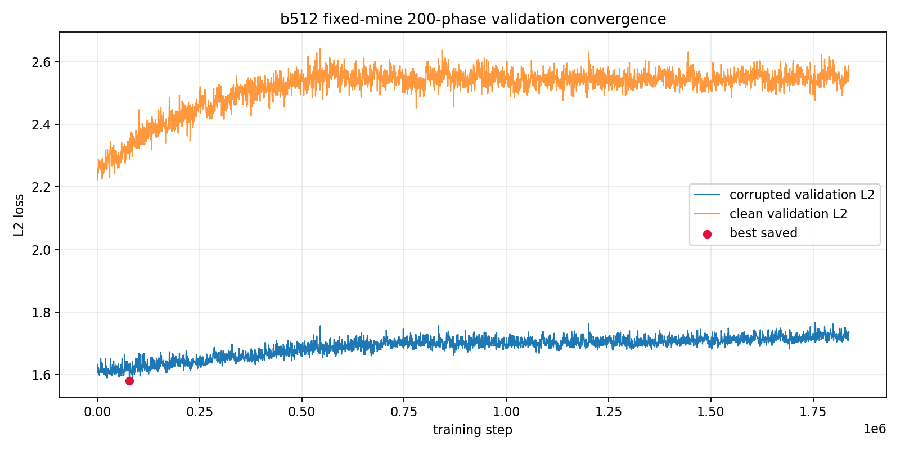
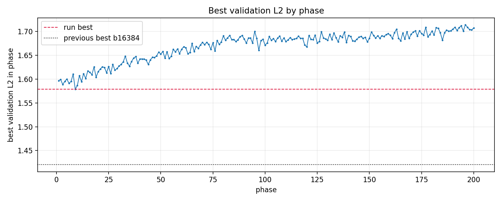
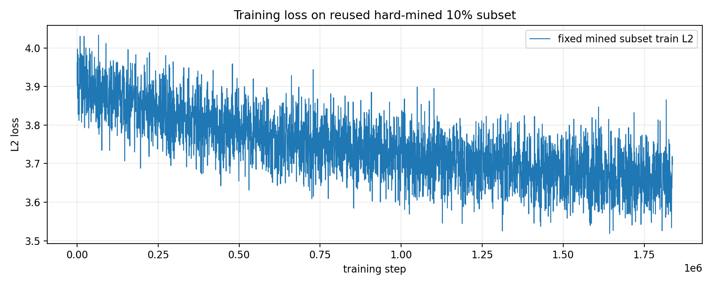
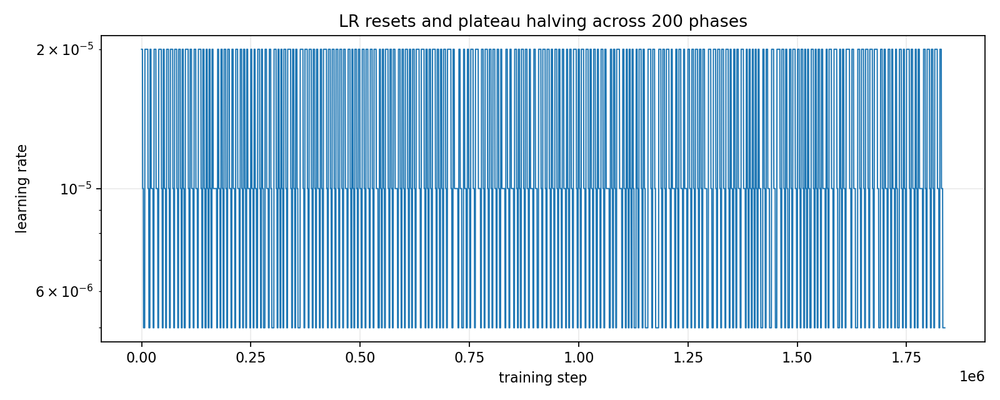
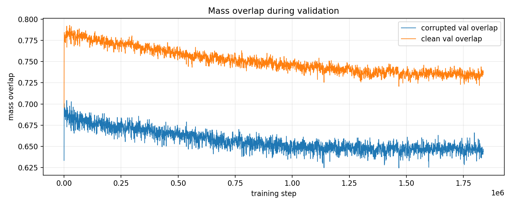

# Simple Voxel z8 b512 Fixed-Mine 200-Phase Continuation

This run continued from the latest fixed-mine state and used batch size `512`, half corruption, one hard-mined 10% subset selected in phase 1, and `200` LR-reset phases. The subset was reused in every later phase; only the optimizer/LR state reset.

## Verdict

The run completed cleanly, but it did **not** beat the earlier b16384 continuation checkpoint. The best validation L2 happened early, at phase `9` / step `78,336`. Later phases mostly fit the fixed mined subset while held-out validation drifted upward.

| run | batch | phases | best val L2 | best step | clean test L2 | corrupted test L2 |
|---|---:|---:|---:|---:|---:|---:|
| b512 fixed-mine 200-phase | 512 | 200 | 1.579057 | 78,336 | 1.799484 | 1.320706 |
| previous b16384 continuation | 16384 | 10 | 1.420299 | 1 | 1.453231 | 0.955729 |

## Run Setup

| setting | value |
|---|---:|
| input cache | `local_data/processed/phase2_voxel_energy_8x32x32_representative_v001` |
| checkpoint init | `phase2_simple_voxel_ae_z8_b16384_halfcorr_fixedmine_continue_v001/checkpoint_latest.pt` |
| latent dim | 8 |
| batch size | 512 |
| phases | 200 |
| total optimizer steps | 1,837,568 |
| total wall time | 84.49 min |
| mean phase time | 25.35 s |
| hard-mined rows | 75,777 / 757,765 |
| corruption | blur kernel 5, blur mix 0.5, noise std 0.02, voxel dropout 0.04 |

## Curves

## Best And Final Rows

| row | step | phase | lr | train L2 | val L2 | clean val L2 | val overlap | clean overlap |
|---|---:|---:|---:|---:|---:|---:|---:|---:|
| best | 78,336 | 9 | 2.00e-05 | 3.889943 | 1.579057 | 2.288556 | 0.6698 | 0.7742 |
| final | 1,837,568 | 200 | 5.00e-06 | 3.708609 | 1.733949 | 2.556077 | 0.6438 | 0.7365 |

## Best Phases

| phase | best step | best val L2 | steps in phase | phase time s |
|---:|---:|---:|---:|---:|
| 9 | 78,336 | 1.579057 | 9,216 | 25.12 |
| 10 | 86,528 | 1.586614 | 8,192 | 22.30 |
| 3 | 24,064 | 1.588742 | 9,216 | 25.08 |
| 6 | 52,736 | 1.591144 | 7,680 | 20.85 |
| 12 | 104,448 | 1.594723 | 10,752 | 29.26 |
| 7 | 59,392 | 1.595412 | 8,704 | 23.67 |
| 4 | 34,816 | 1.595418 | 10,752 | 29.18 |
| 1 | 5,120 | 1.596751 | 7,168 | 19.63 |

## Test Metrics From Saved Best

| split/input | L2 | p50 L2 | p95 L2 | mass overlap | energy relative L1 |
|---|---:|---:|---:|---:|---:|
| clean test | 1.799484 | 1.573756 | 3.266199 | 0.8080 | 0.8798 |
| corrupted test | 1.320706 | 1.194419 | 2.363400 | 0.6674 | 19912.1855 |

The corrupted-test energy relative L1 is numerically unstable because some noised inputs have tiny/near-zero denominators after corruption and dropout. The plain tensor L2 and mass-overlap metrics are the more reliable comparison for this experiment.

## Gallery

The reconstruction gallery generated from the saved checkpoint is here:

[phase2-simple-voxel-z8-b512-halfcorr-fixedmine-200phase-gallery.md](phase2-simple-voxel-z8-b512-halfcorr-fixedmine-200phase-gallery.md)

## Interpretation

This pass confirms that repeatedly resetting LR on the same fixed hard-mined subset is not enough. The training subset loss gradually improves, but validation does not follow. For the next useful experiment, either re-enable remine-per-phase with stronger validation checkpoint selection, or stop these z8 voxel AEs and move to a shape-family/clustering objective rather than trying to force reconstruction quality through repeated hard-subset fitting.
