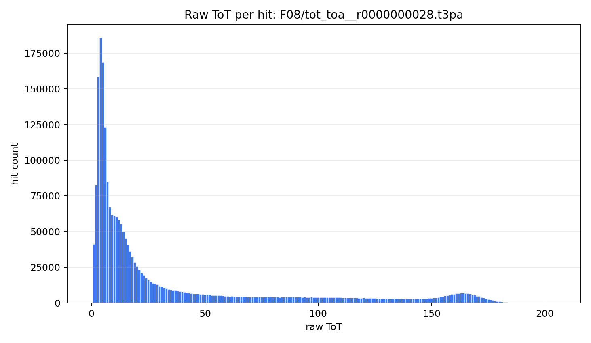
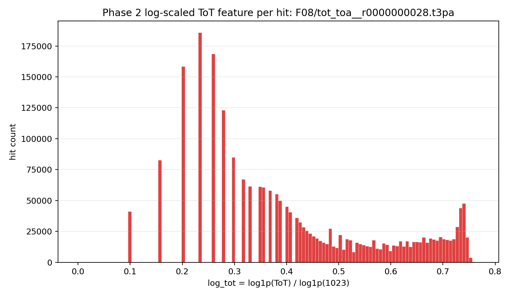
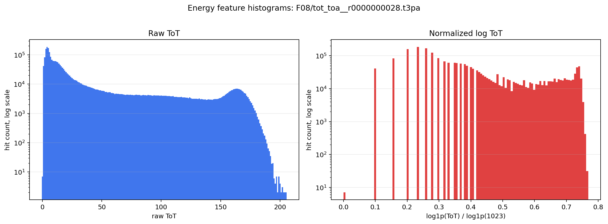

# Energy Histograms For A Crowded File

File: `F08/tot_toa__r0000000028.t3pa`

Source shard: `local_data/processed/particles_aligned_time_eps5_v001/F08/tot_toa__r0000000028.particles.npz`

Total hits: `2,326,137`

Noise hits in current particle labeling: `14,823` (`0.637%`)

The NN input energy feature is log-scaled and normalized:

```text
log_tot = log1p(ToT) / log1p(1023)
```

## Raw ToT Histogram



## Normalized Log ToT Histogram



## Tail View With Log Y-Axis



## Summary Statistics

| feature | min | p50 | p90 | p99 | max |
|---|---:|---:|---:|---:|---:|
| raw ToT | 0.000 | 13.000 | 121.000 | 172.000 | 205.000 |
| log1p(ToT) | 0.000 | 2.639 | 4.804 | 5.153 | 5.328 |
| normalized log_tot | 0.000 | 0.381 | 0.693 | 0.743 | 0.769 |
