# Native Grid DBSCAN Fine-Time Voxel-Cube Gallery

Transparent cube rendering of the largest labels from the fine-time native-grid DBSCAN sample. One cube is one detector pixel by one fine time bin.

The z axis is `round((ToA - FToA / 16) * 16)`, so one z-unit is one fine Timepix sub-tick (1.5625 ns). Axes use equal data scaling: one x pixel, one y pixel, and one fine-time bin are rendered as the same cube size.

For a full-file view of `F08/tot_toa__r0000000028.t3pa`, see [native-grid-dbscan-fine-voxel-like-whole-file-F08-0028-cubes.md](native-grid-dbscan-fine-voxel-like-whole-file-F08-0028-cubes.md).

## Input Files

| source | hits | particles | noise frac | runtime s | hits/s | warnings |
|---|---:|---:|---:|---:|---:|---|
| `F08/tot_toa__r0000000028.t3pa` | 2,326,137 | 357,598 | 0.393 | 9.518 | 244,394 | `high_noise_fraction=0.393` |
| `F08/tot_toa__r0000000052.t3pa` | 2,452,962 | 378,140 | 0.394 | 10.091 | 243,080 | `high_noise_fraction=0.394` |
| `data M07/sync__M07-W0044_r000.t3pa` | 1,413,287 | 158,285 | 0.750 | 5.595 | 252,608 | `high_noise_fraction=0.750` |

## Largest Labels As Cubes

Each image has two panels: left is the full DBSCAN label colored by energy; right recolors the same occupied cubes by strict face-connected components. If the right panel has many colors, the label is still only corner/edge-connected rather than face-continuous.

| rank | source | particle | hits | voxels | z span ns | face comps | corner comps | image |
|---:|---|---:|---:|---:|---:|---:|---:|---|
| 1 | `F08/tot_toa__r0000000028.t3pa` | 26944 | 403 | 403 | 23.44 | 296 | 1 | [png](../../assets/native_grid_dbscan_fine_voxel_like_sample_v001/largest_01_tot_toa__r0000000028_p26944_cubes.png) |
| 2 | `F08/tot_toa__r0000000028.t3pa` | 20416 | 353 | 353 | 23.44 | 237 | 1 | [png](../../assets/native_grid_dbscan_fine_voxel_like_sample_v001/largest_02_tot_toa__r0000000028_p20416_cubes.png) |
| 3 | `F08/tot_toa__r0000000052.t3pa` | 163637 | 298 | 298 | 18.75 | 206 | 1 | [png](../../assets/native_grid_dbscan_fine_voxel_like_sample_v001/largest_03_tot_toa__r0000000052_p163637_cubes.png) |
| 4 | `F08/tot_toa__r0000000028.t3pa` | 12688 | 277 | 277 | 21.88 | 202 | 1 | [png](../../assets/native_grid_dbscan_fine_voxel_like_sample_v001/largest_04_tot_toa__r0000000028_p12688_cubes.png) |
| 5 | `F08/tot_toa__r0000000028.t3pa` | 162344 | 270 | 270 | 20.31 | 195 | 1 | [png](../../assets/native_grid_dbscan_fine_voxel_like_sample_v001/largest_05_tot_toa__r0000000028_p162344_cubes.png) |
| 6 | `F08/tot_toa__r0000000028.t3pa` | 148453 | 265 | 265 | 26.56 | 204 | 1 | [png](../../assets/native_grid_dbscan_fine_voxel_like_sample_v001/largest_06_tot_toa__r0000000028_p148453_cubes.png) |
| 7 | `F08/tot_toa__r0000000028.t3pa` | 245297 | 263 | 263 | 20.31 | 178 | 1 | [png](../../assets/native_grid_dbscan_fine_voxel_like_sample_v001/largest_07_tot_toa__r0000000028_p245297_cubes.png) |
| 8 | `F08/tot_toa__r0000000028.t3pa` | 261470 | 262 | 262 | 15.62 | 189 | 1 | [png](../../assets/native_grid_dbscan_fine_voxel_like_sample_v001/largest_08_tot_toa__r0000000028_p261470_cubes.png) |
| 9 | `F08/tot_toa__r0000000028.t3pa` | 259800 | 258 | 258 | 21.88 | 188 | 1 | [png](../../assets/native_grid_dbscan_fine_voxel_like_sample_v001/largest_09_tot_toa__r0000000028_p259800_cubes.png) |
| 10 | `F08/tot_toa__r0000000028.t3pa` | 160128 | 257 | 257 | 28.12 | 176 | 1 | [png](../../assets/native_grid_dbscan_fine_voxel_like_sample_v001/largest_10_tot_toa__r0000000028_p160128_cubes.png) |
| 11 | `F08/tot_toa__r0000000052.t3pa` | 278678 | 256 | 256 | 21.88 | 176 | 1 | [png](../../assets/native_grid_dbscan_fine_voxel_like_sample_v001/largest_11_tot_toa__r0000000052_p278678_cubes.png) |
| 12 | `F08/tot_toa__r0000000052.t3pa` | 183088 | 250 | 250 | 23.44 | 168 | 1 | [png](../../assets/native_grid_dbscan_fine_voxel_like_sample_v001/largest_12_tot_toa__r0000000052_p183088_cubes.png) |
| 13 | `F08/tot_toa__r0000000052.t3pa` | 25847 | 248 | 248 | 17.19 | 166 | 1 | [png](../../assets/native_grid_dbscan_fine_voxel_like_sample_v001/largest_13_tot_toa__r0000000052_p25847_cubes.png) |
| 14 | `F08/tot_toa__r0000000028.t3pa` | 113963 | 246 | 246 | 20.31 | 181 | 1 | [png](../../assets/native_grid_dbscan_fine_voxel_like_sample_v001/largest_14_tot_toa__r0000000028_p113963_cubes.png) |
| 15 | `F08/tot_toa__r0000000052.t3pa` | 196028 | 233 | 233 | 18.75 | 148 | 1 | [png](../../assets/native_grid_dbscan_fine_voxel_like_sample_v001/largest_15_tot_toa__r0000000052_p196028_cubes.png) |
| 16 | `F08/tot_toa__r0000000052.t3pa` | 234675 | 228 | 228 | 21.88 | 162 | 1 | [png](../../assets/native_grid_dbscan_fine_voxel_like_sample_v001/largest_16_tot_toa__r0000000052_p234675_cubes.png) |
| 17 | `F08/tot_toa__r0000000052.t3pa` | 56021 | 226 | 226 | 15.62 | 152 | 1 | [png](../../assets/native_grid_dbscan_fine_voxel_like_sample_v001/largest_17_tot_toa__r0000000052_p56021_cubes.png) |
| 18 | `F08/tot_toa__r0000000052.t3pa` | 165086 | 217 | 217 | 23.44 | 144 | 1 | [png](../../assets/native_grid_dbscan_fine_voxel_like_sample_v001/largest_18_tot_toa__r0000000052_p165086_cubes.png) |

### Rank 1

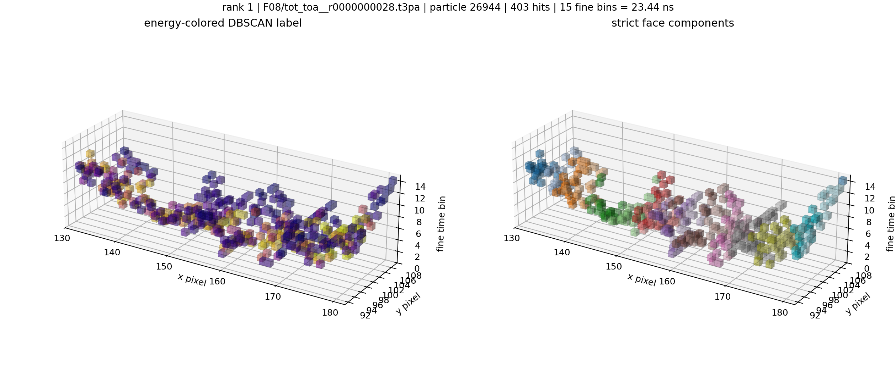

### Rank 2

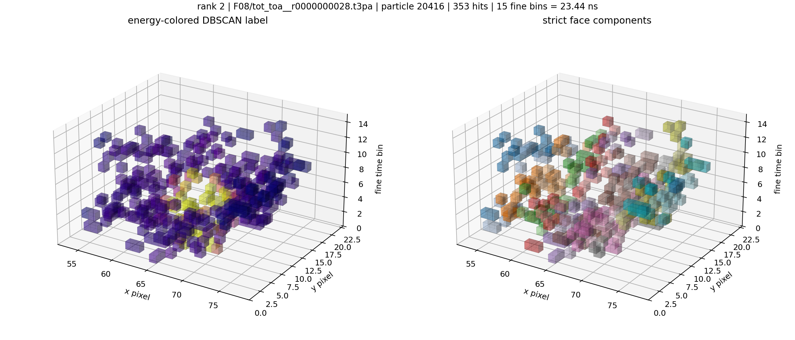

### Rank 3

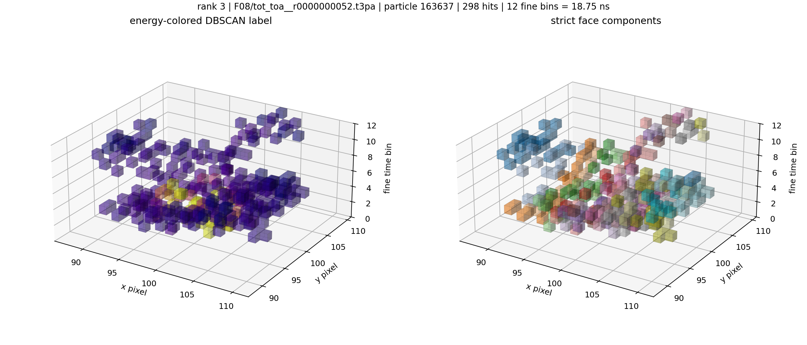

### Rank 4

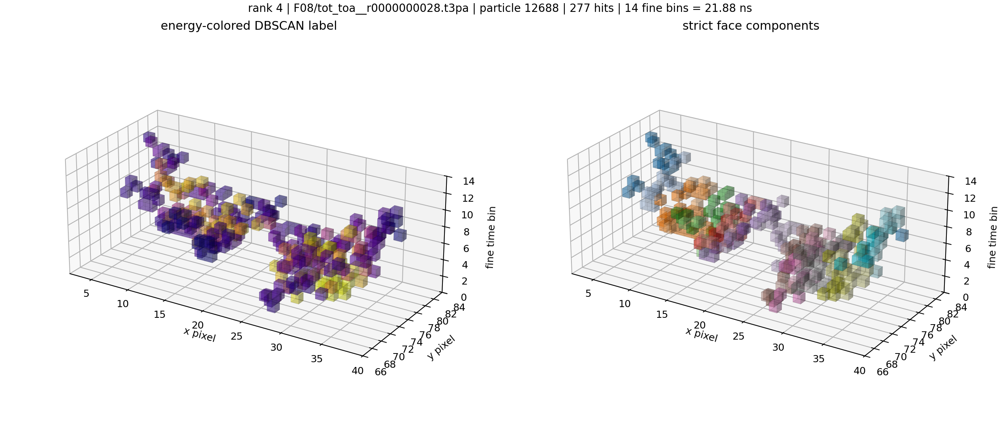

### Rank 5

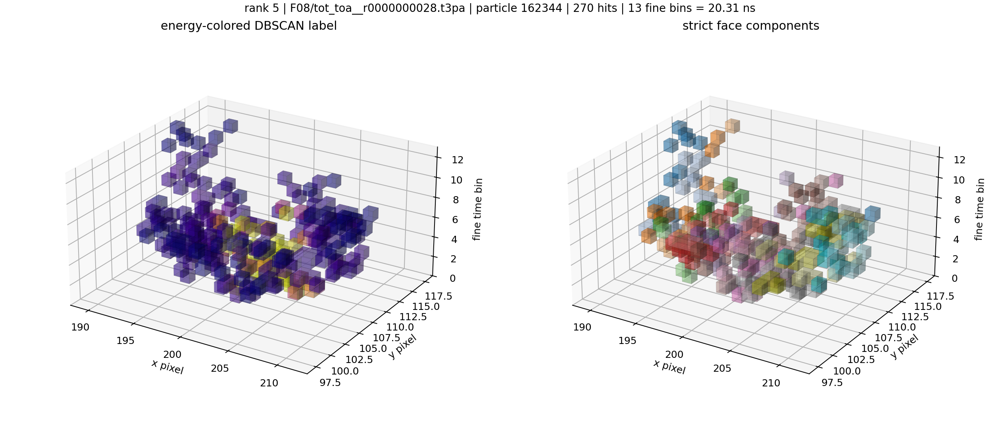

### Rank 6

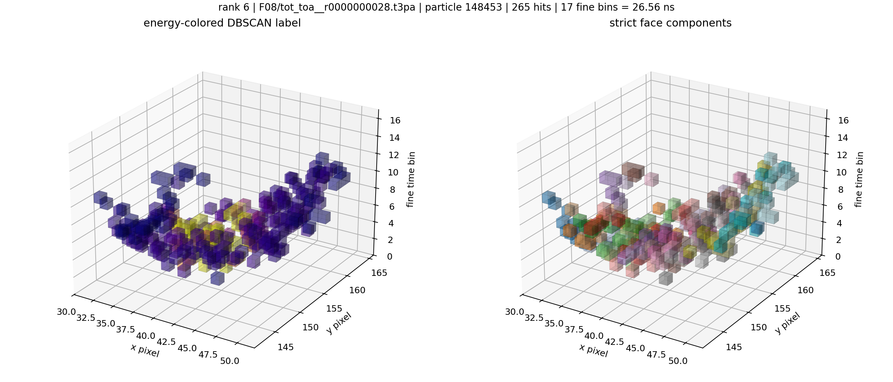

### Rank 7

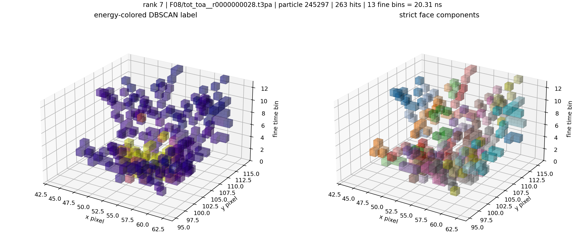

### Rank 8

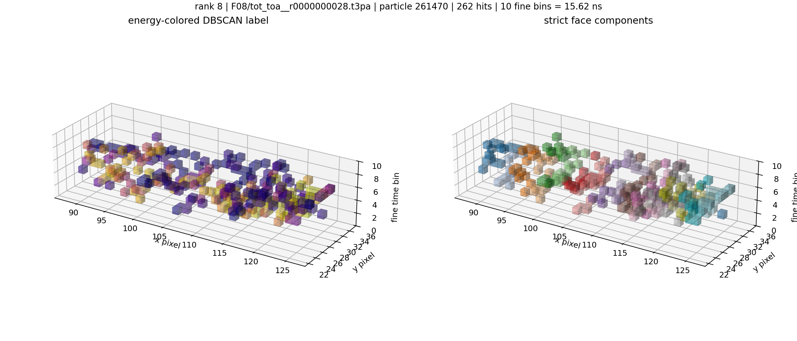

### Rank 9

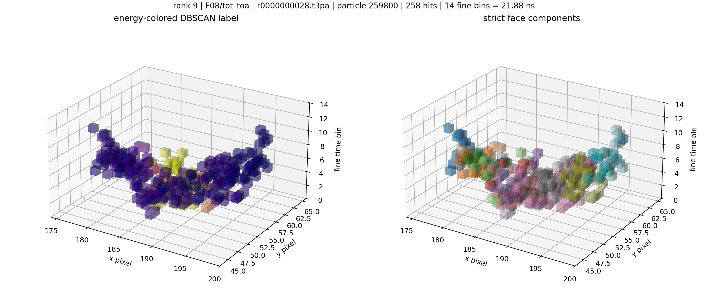

### Rank 10

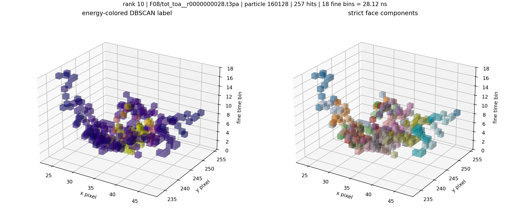

### Rank 11

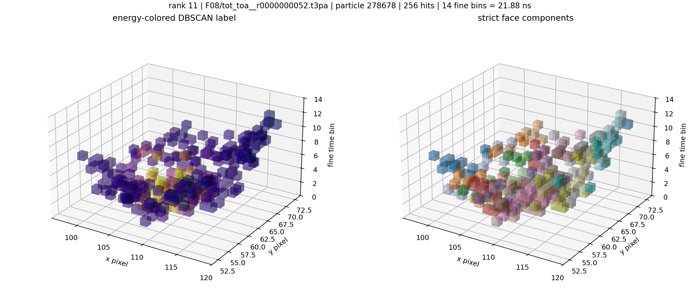

### Rank 12

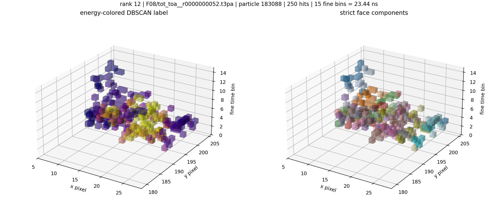

### Rank 13

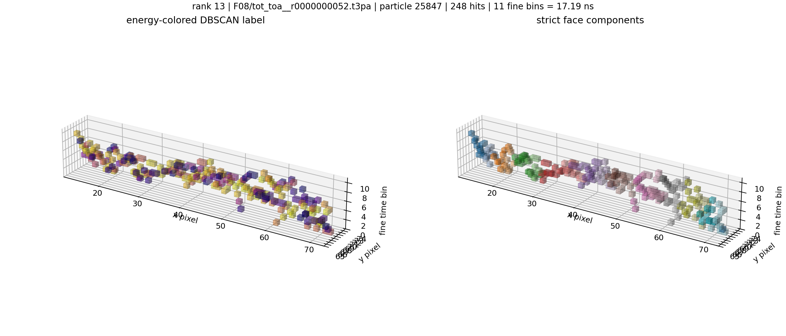

### Rank 14

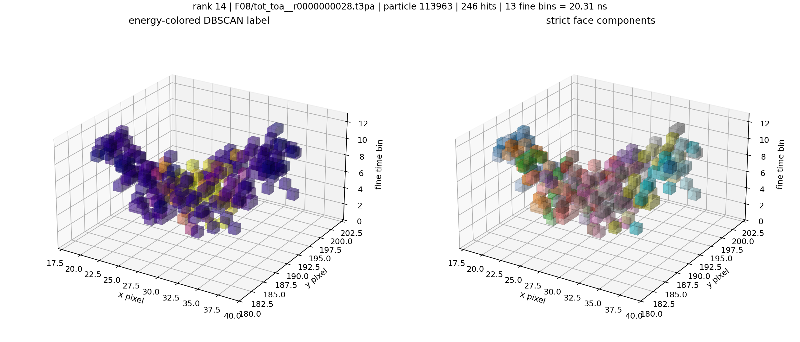

### Rank 15

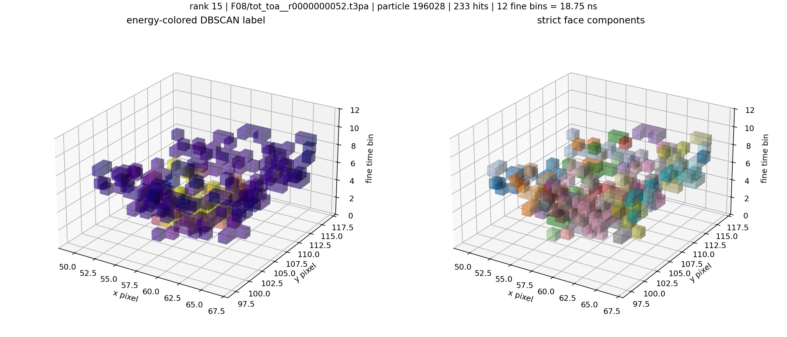

### Rank 16

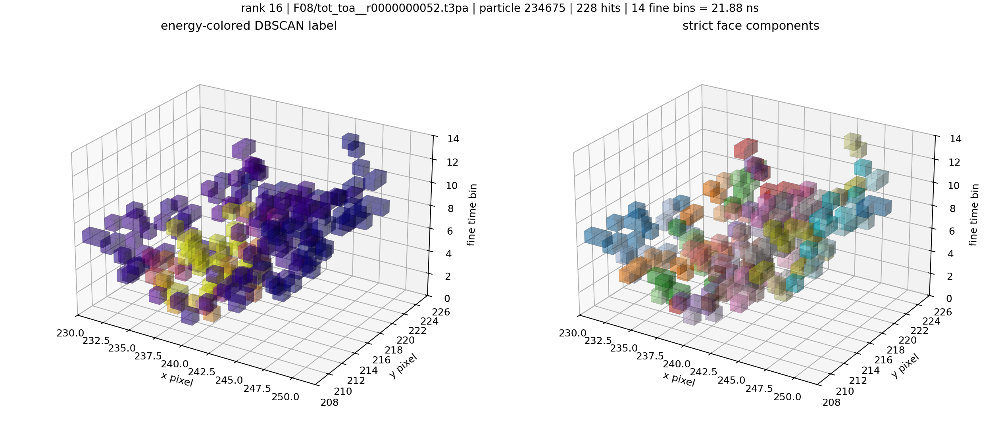

### Rank 17

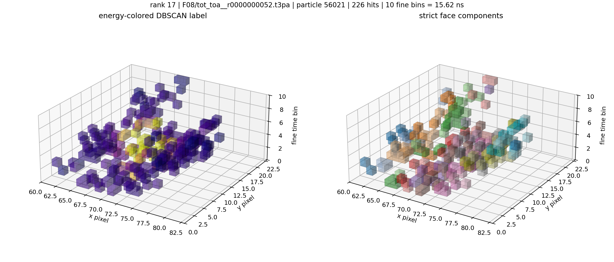

### Rank 18

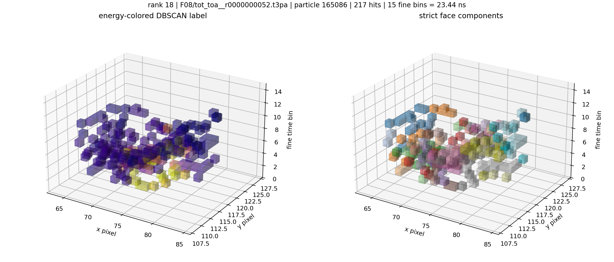
