# Reasonable File Many-Particle Fixed-Detector Cube Overview: 08 Thu 7333, 10x Time

Source shard: `local_data/processed/native_grid_dbscan_reasonable_file_v001/particles_fine_voxel_like/08_thu_proton_daily_batch/toa_tot__r0000007333.particles.npz`

Raw source: `local_data/raw/08_thu_proton_daily_batch/toa_tot__r0000007333.t3pa`

This is a whole-file inspection view. A literal one-image, equal-axis rendering of every cube is not useful because this file spans `12,777,351,155` fine-time bins. The report therefore uses whole-file summaries plus an equal-cube atlas of the densest short time windows.

- hits: `88,825`
- particles: `15,160`
- noise fraction: `0.434`
- fine-time span: `12,777,351,155` bins = `19.965` s
- plotted z cube: `10` fine bins = `15.6250` ns

## Whole-File Context

## Densest Time Windows As Equal Cubes

Each window uses real cube scaling: one x pixel, one y pixel, and one fine time bin have the same drawn size. The z axis is local to the selected time window, but the table gives absolute relative acquisition time.

The x/y axes are fixed to the full detector plane `0..256`.

Windows were selected by `particles`.

| rank | start s | span ns | z cube ns | hits | voxels | particles | noise frac | image |
|---:|---:|---:|---:|---:|---:|---:|---:|---|
| 1 | 16.367672 | 4000.0 | 15.6250 | 610 | 610 | 63 | 0.243 | [png](../../assets/native_grid_dbscan_fine_voxel_like_reasonable_08_7333_many_particles_10x_time/whole_file_window_01_z10475310080_10475312640_cubes.png) |
| 2 | 12.671124 | 4000.0 | 15.6250 | 210 | 210 | 32 | 0.324 | [png](../../assets/native_grid_dbscan_fine_voxel_like_reasonable_08_7333_many_particles_10x_time/whole_file_window_02_z8109519360_8109521920_cubes.png) |
| 3 | 11.350904 | 4000.0 | 15.6250 | 307 | 307 | 28 | 0.248 | [png](../../assets/native_grid_dbscan_fine_voxel_like_reasonable_08_7333_many_particles_10x_time/whole_file_window_03_z7264578560_7264581120_cubes.png) |
| 4 | 19.519792 | 4000.0 | 15.6250 | 151 | 151 | 23 | 0.437 | [png](../../assets/native_grid_dbscan_fine_voxel_like_reasonable_08_7333_many_particles_10x_time/whole_file_window_04_z12492666880_12492669440_cubes.png) |
| 5 | 11.602624 | 4000.0 | 15.6250 | 110 | 110 | 23 | 0.327 | [png](../../assets/native_grid_dbscan_fine_voxel_like_reasonable_08_7333_many_particles_10x_time/whole_file_window_05_z7425679360_7425681920_cubes.png) |
| 6 | 18.028472 | 4000.0 | 15.6250 | 127 | 127 | 21 | 0.252 | [png](../../assets/native_grid_dbscan_fine_voxel_like_reasonable_08_7333_many_particles_10x_time/whole_file_window_06_z11538222080_11538224640_cubes.png) |
| 7 | 13.653520 | 4000.0 | 15.6250 | 140 | 140 | 20 | 0.300 | [png](../../assets/native_grid_dbscan_fine_voxel_like_reasonable_08_7333_many_particles_10x_time/whole_file_window_07_z8738252800_8738255360_cubes.png) |
| 8 | 12.120828 | 4000.0 | 15.6250 | 111 | 111 | 20 | 0.387 | [png](../../assets/native_grid_dbscan_fine_voxel_like_reasonable_08_7333_many_particles_10x_time/whole_file_window_08_z7757329920_7757332480_cubes.png) |
| 9 | 17.598084 | 4000.0 | 15.6250 | 168 | 168 | 18 | 0.339 | [png](../../assets/native_grid_dbscan_fine_voxel_like_reasonable_08_7333_many_particles_10x_time/whole_file_window_09_z11262773760_11262776320_cubes.png) |
| 10 | 12.912552 | 4000.0 | 15.6250 | 147 | 147 | 18 | 0.143 | [png](../../assets/native_grid_dbscan_fine_voxel_like_reasonable_08_7333_many_particles_10x_time/whole_file_window_10_z8264033280_8264035840_cubes.png) |
| 11 | 18.854452 | 4000.0 | 15.6250 | 145 | 145 | 18 | 0.331 | [png](../../assets/native_grid_dbscan_fine_voxel_like_reasonable_08_7333_many_particles_10x_time/whole_file_window_11_z12066849280_12066851840_cubes.png) |
| 12 | 13.151576 | 4000.0 | 15.6250 | 139 | 139 | 18 | 0.237 | [png](../../assets/native_grid_dbscan_fine_voxel_like_reasonable_08_7333_many_particles_10x_time/whole_file_window_12_z8417008640_8417011200_cubes.png) |

### Window 1

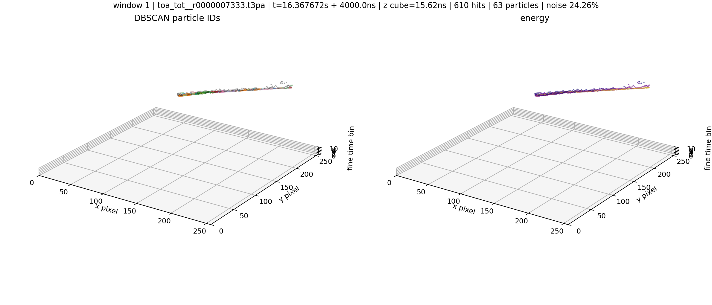

### Window 2

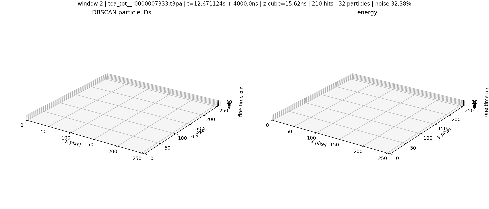

### Window 3

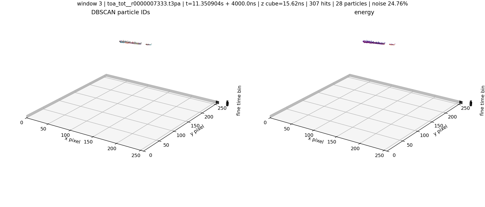

### Window 4

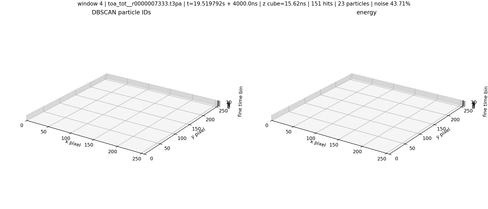

### Window 5

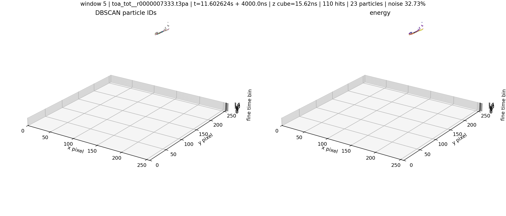

### Window 6

### Window 7

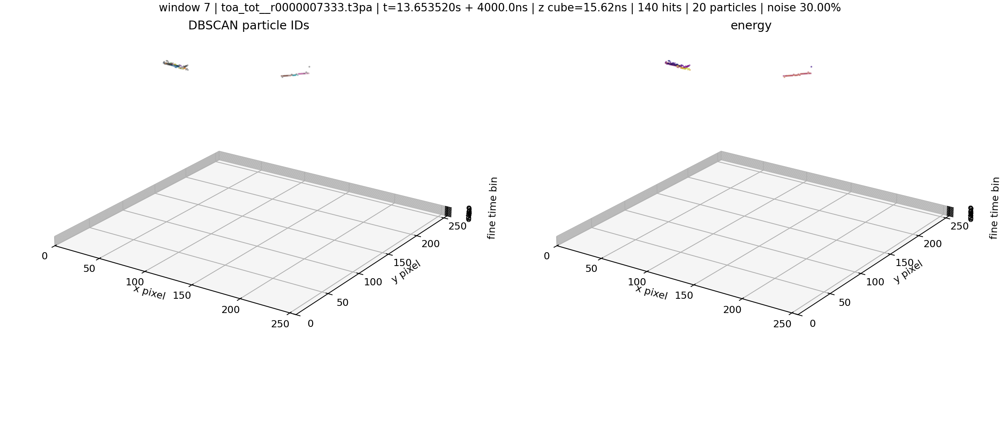

### Window 8

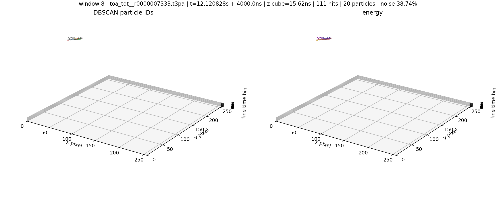

### Window 9

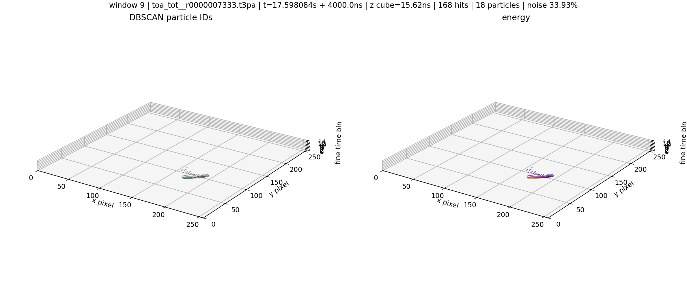

### Window 10

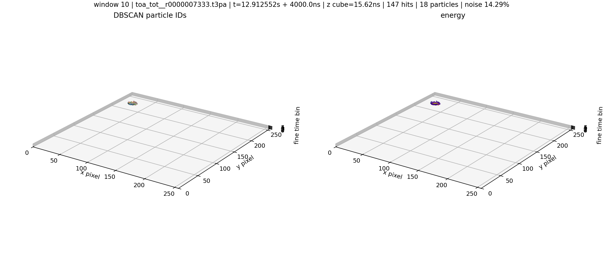

### Window 11

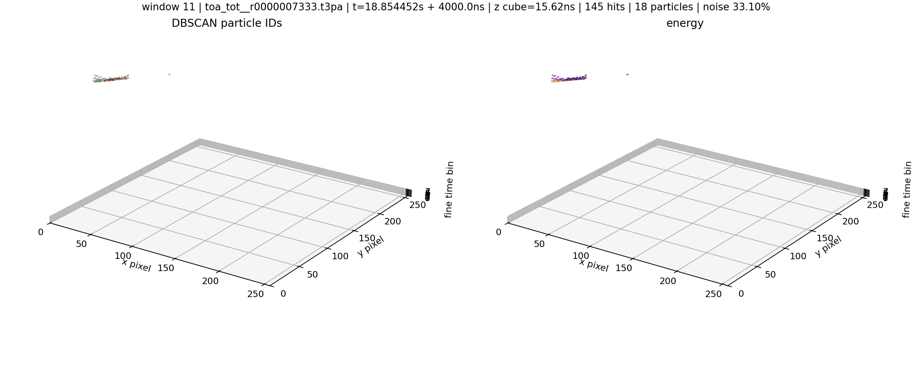

### Window 12

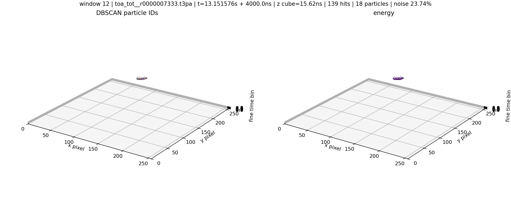
