# Whole-File Fine-Time Native DBSCAN Cube Overview: F08 r0000000028

Source shard: `local_data/processed/native_grid_dbscan_fine_sample_v001/particles_fine_voxel_like/F08/tot_toa__r0000000028.particles.npz`

Raw source: `local_data/raw/F08/tot_toa__r0000000028.t3pa`

This is a whole-file inspection view. A literal one-image, equal-axis rendering of every cube is not useful because this file spans `12,796,637,466` fine-time bins. The report therefore uses whole-file summaries plus an equal-cube atlas of the densest short time windows.

- hits: `2,326,137`
- particles: `357,598`
- noise fraction: `0.393`
- fine-time span: `12,796,637,466` bins = `19.995` s

## Whole-File Context

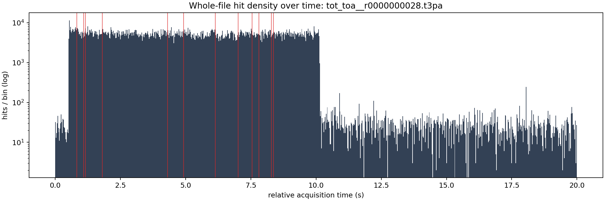

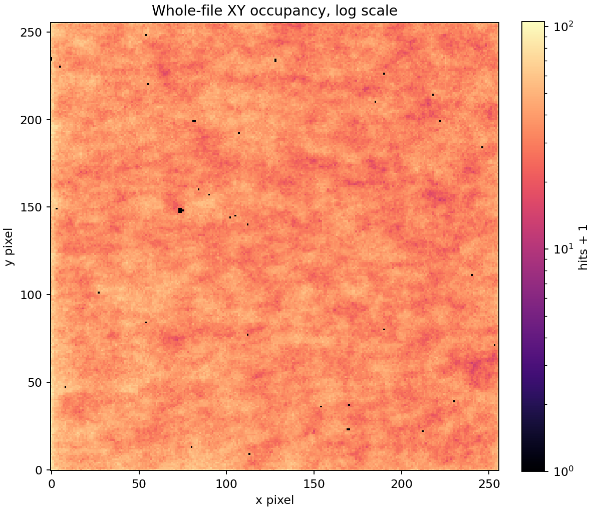

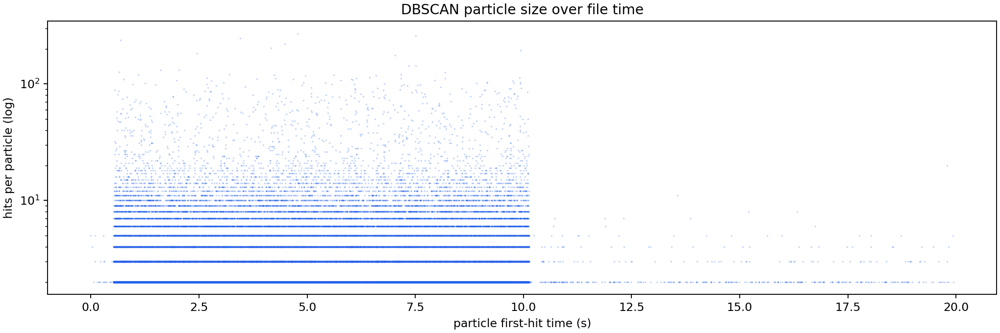

## Densest Time Windows As Equal Cubes

Each window uses real cube scaling: one x pixel, one y pixel, and one fine time bin have the same drawn size. The z axis is local to the selected time window, but the table gives absolute relative acquisition time.

| rank | start s | span ns | hits | voxels | particles | noise frac | image |
|---:|---:|---:|---:|---:|---:|---:|---|
| 1 | 1.165547 | 50.0 | 1,524 | 1,524 | 140 | 0.188 | [png](../../assets/native_grid_dbscan_fine_voxel_like_whole_file_F08_0028/whole_file_window_01_z745949760_745949792_cubes.png) |
| 2 | 6.142739 | 50.0 | 1,130 | 1,130 | 113 | 0.151 | [png](../../assets/native_grid_dbscan_fine_voxel_like_whole_file_F08_0028/whole_file_window_02_z3931353184_3931353216_cubes.png) |
| 3 | 7.552729 | 50.0 | 1,046 | 1,046 | 106 | 0.145 | [png](../../assets/native_grid_dbscan_fine_voxel_like_whole_file_F08_0028/whole_file_window_03_z4833746752_4833746784_cubes.png) |
| 4 | 7.019121 | 50.0 | 1,033 | 1,033 | 107 | 0.167 | [png](../../assets/native_grid_dbscan_fine_voxel_like_whole_file_F08_0028/whole_file_window_04_z4492237632_4492237664_cubes.png) |
| 5 | 1.808094 | 50.0 | 1,028 | 1,028 | 116 | 0.110 | [png](../../assets/native_grid_dbscan_fine_voxel_like_whole_file_F08_0028/whole_file_window_05_z1157180256_1157180288_cubes.png) |
| 6 | 1.096695 | 50.0 | 964 | 964 | 129 | 0.195 | [png](../../assets/native_grid_dbscan_fine_voxel_like_whole_file_F08_0028/whole_file_window_06_z701884512_701884544_cubes.png) |
| 7 | 0.830106 | 50.0 | 956 | 956 | 92 | 0.208 | [png](../../assets/native_grid_dbscan_fine_voxel_like_whole_file_F08_0028/whole_file_window_07_z531268096_531268128_cubes.png) |
| 8 | 4.922254 | 50.0 | 767 | 767 | 88 | 0.202 | [png](../../assets/native_grid_dbscan_fine_voxel_like_whole_file_F08_0028/whole_file_window_08_z3150242528_3150242560_cubes.png) |
| 9 | 7.807824 | 50.0 | 740 | 740 | 95 | 0.199 | [png](../../assets/native_grid_dbscan_fine_voxel_like_whole_file_F08_0028/whole_file_window_09_z4997007104_4997007136_cubes.png) |
| 10 | 8.292036 | 50.0 | 731 | 731 | 79 | 0.168 | [png](../../assets/native_grid_dbscan_fine_voxel_like_whole_file_F08_0028/whole_file_window_10_z5306903136_5306903168_cubes.png) |
| 11 | 8.364994 | 50.0 | 730 | 730 | 80 | 0.163 | [png](../../assets/native_grid_dbscan_fine_voxel_like_whole_file_F08_0028/whole_file_window_11_z5353596288_5353596320_cubes.png) |
| 12 | 4.310009 | 50.0 | 721 | 721 | 119 | 0.294 | [png](../../assets/native_grid_dbscan_fine_voxel_like_whole_file_F08_0028/whole_file_window_12_z2758405664_2758405696_cubes.png) |

### Window 1

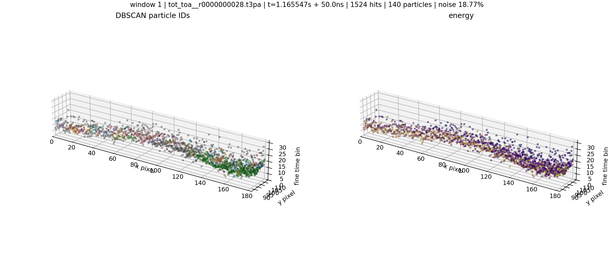

### Window 2

### Window 3

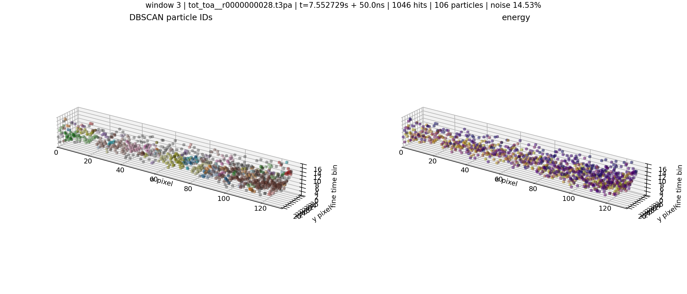

### Window 4

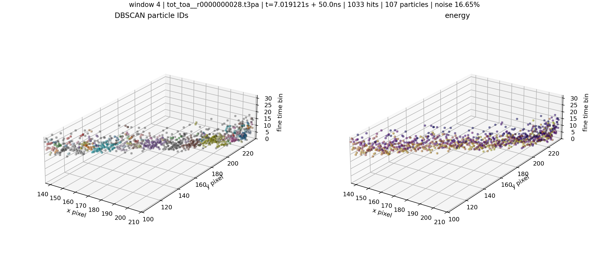

### Window 5

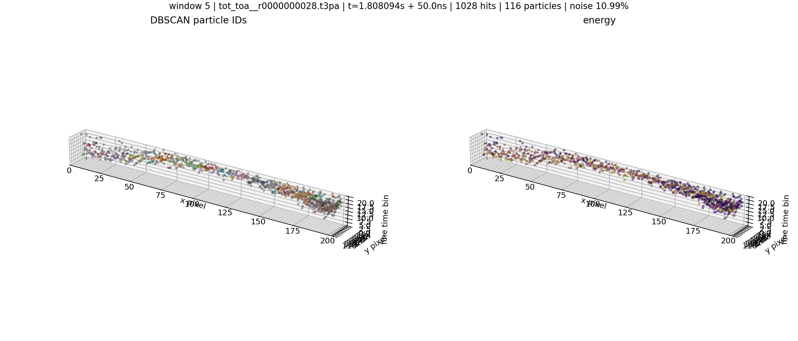

### Window 6

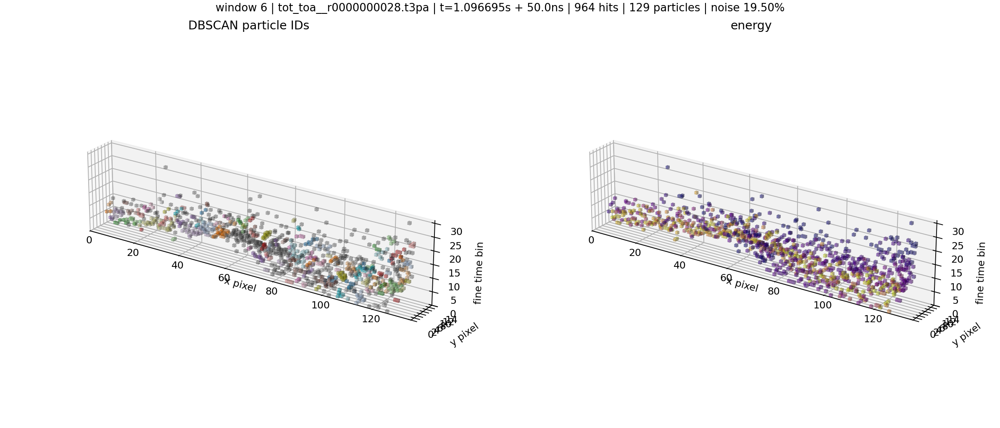

### Window 7

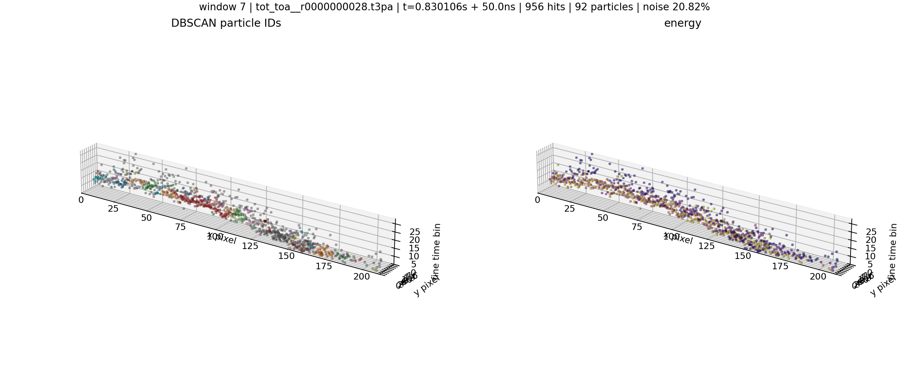

### Window 8

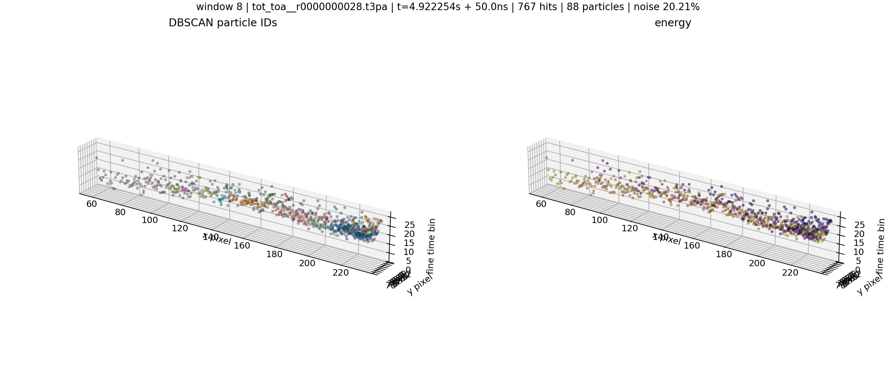

### Window 9

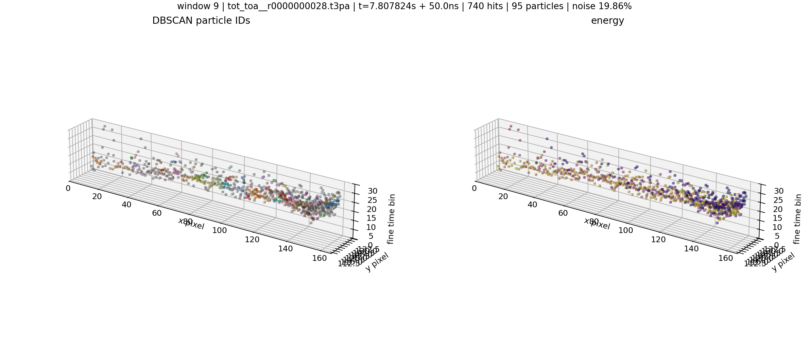

### Window 10

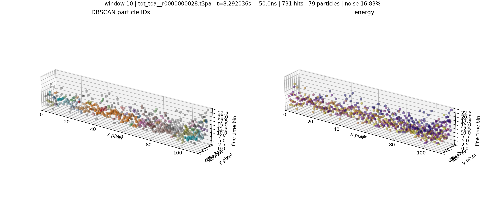

### Window 11

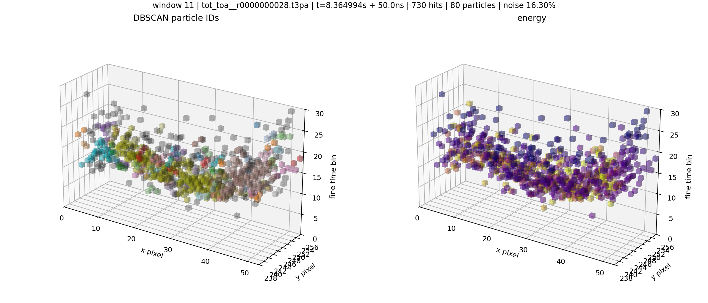

### Window 12

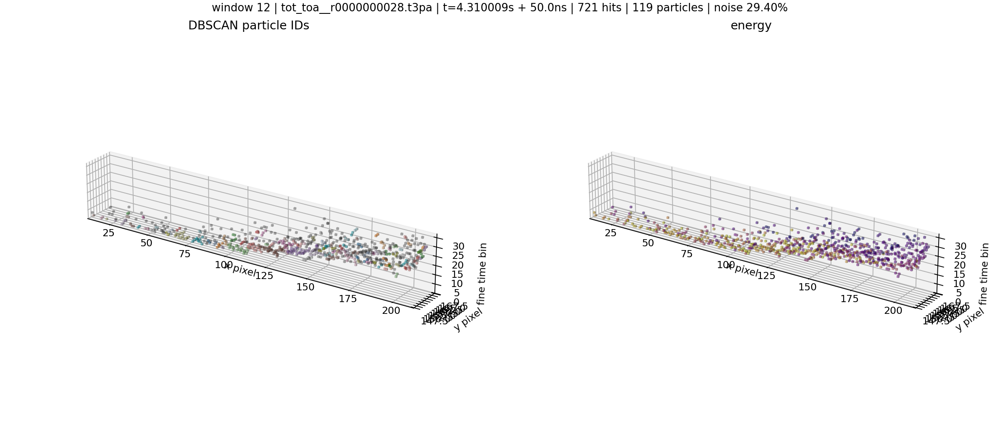
