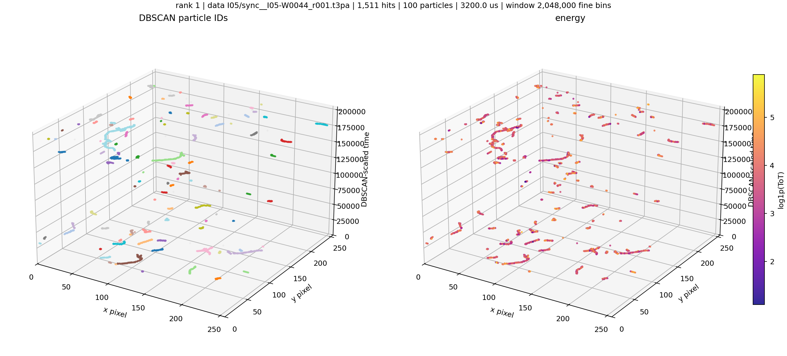
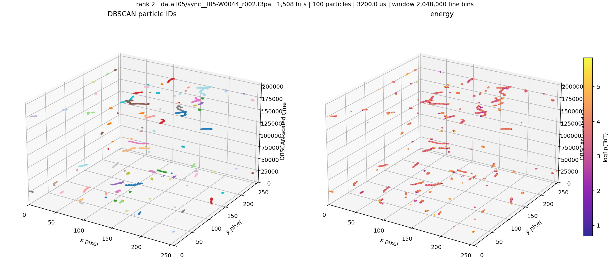
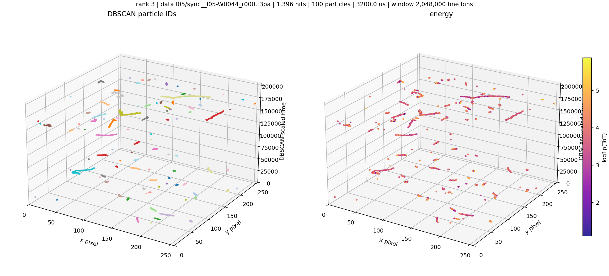
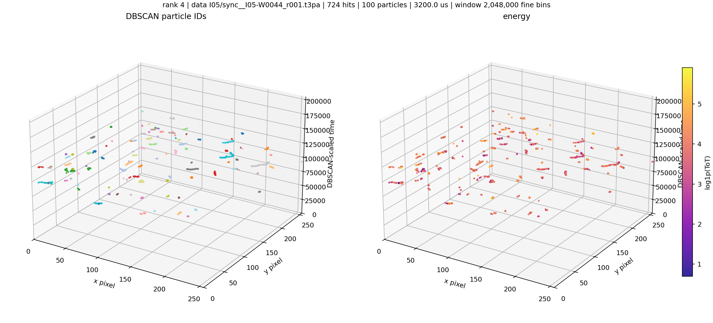
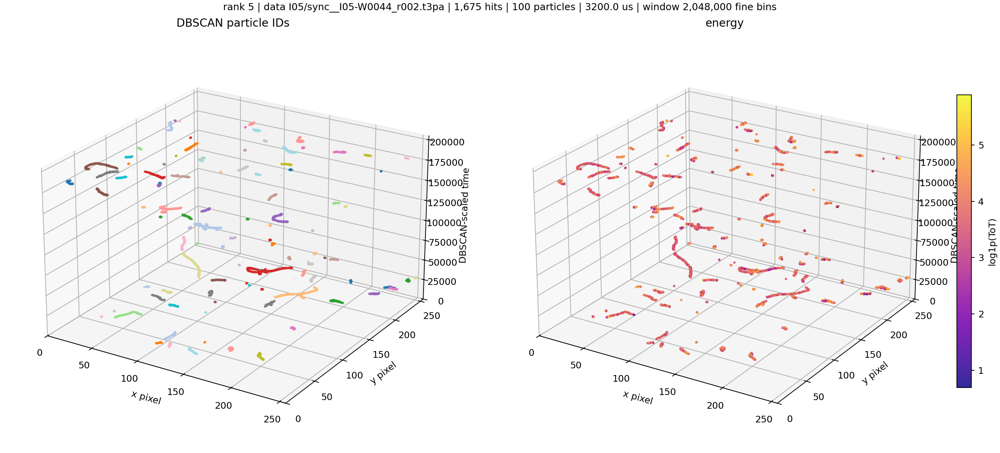
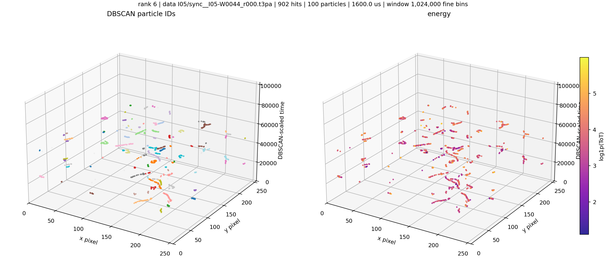
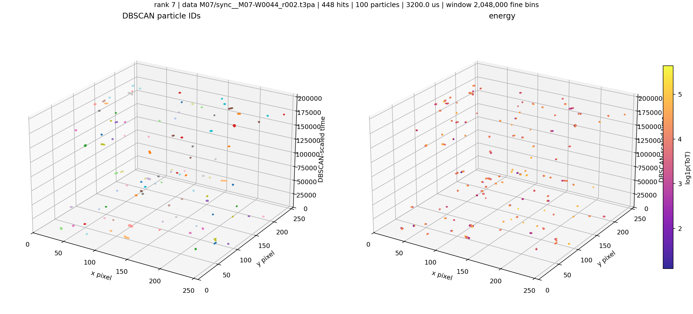
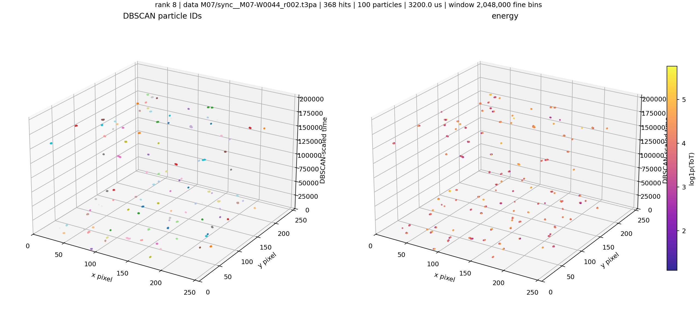

# Aligned-Time eps5 Approx. 100-Particle Windows

Source manifest: `local_data/processed/particles_aligned_time_eps5_v001/manifest.csv`

Target particle count: `100` with tolerance `25`.

These are fixed time buckets selected from the highest-particle-count shards. The z coordinate is `z = (ToA - FToA / 16 - window_start) / 0.625`, the same scaled time used by the current aligned-time DBSCAN setting.

| rank | source | start s | span us | fine bins | scaled span | hits | particles | noise frac | image |
|---:|---|---:|---:|---:|---:|---:|---:|---:|---|
| 1 | `data I05/sync__I05-W0044_r001.t3pa` | 56.416000 | 3200.0 | 2,048,000 | 204800.0 | 1,511 | 100 | 0.016 | [png](../../assets/native_grid_dbscan_aligned_time_eps5_approx_100_particle_windows/approx100_window_01_sync__I05-W0044_r001_z36106240000_36108288000.png) |
| 2 | `data I05/sync__I05-W0044_r002.t3pa` | 14.160000 | 3200.0 | 2,048,000 | 204800.0 | 1,508 | 100 | 0.019 | [png](../../assets/native_grid_dbscan_aligned_time_eps5_approx_100_particle_windows/approx100_window_02_sync__I05-W0044_r002_z9062400000_9064448000.png) |
| 3 | `data I05/sync__I05-W0044_r000.t3pa` | 58.028800 | 3200.0 | 2,048,000 | 204800.0 | 1,396 | 100 | 0.020 | [png](../../assets/native_grid_dbscan_aligned_time_eps5_approx_100_particle_windows/approx100_window_03_sync__I05-W0044_r000_z37138432000_37140480000.png) |
| 4 | `data I05/sync__I05-W0044_r001.t3pa` | 28.089600 | 3200.0 | 2,048,000 | 204800.0 | 724 | 100 | 0.023 | [png](../../assets/native_grid_dbscan_aligned_time_eps5_approx_100_particle_windows/approx100_window_04_sync__I05-W0044_r001_z17977344000_17979392000.png) |
| 5 | `data I05/sync__I05-W0044_r002.t3pa` | 11.408000 | 3200.0 | 2,048,000 | 204800.0 | 1,675 | 100 | 0.020 | [png](../../assets/native_grid_dbscan_aligned_time_eps5_approx_100_particle_windows/approx100_window_05_sync__I05-W0044_r002_z7301120000_7303168000.png) |
| 6 | `data I05/sync__I05-W0044_r000.t3pa` | 26.857600 | 1600.0 | 1,024,000 | 102400.0 | 902 | 100 | 0.024 | [png](../../assets/native_grid_dbscan_aligned_time_eps5_approx_100_particle_windows/approx100_window_06_sync__I05-W0044_r000_z17188864000_17189888000.png) |
| 7 | `data M07/sync__M07-W0044_r002.t3pa` | 6.400000 | 3200.0 | 2,048,000 | 204800.0 | 448 | 100 | 0.033 | [png](../../assets/native_grid_dbscan_aligned_time_eps5_approx_100_particle_windows/approx100_window_07_sync__M07-W0044_r002_z4096000000_4098048000.png) |
| 8 | `data M07/sync__M07-W0044_r002.t3pa` | 14.553600 | 3200.0 | 2,048,000 | 204800.0 | 368 | 100 | 0.041 | [png](../../assets/native_grid_dbscan_aligned_time_eps5_approx_100_particle_windows/approx100_window_08_sync__M07-W0044_r002_z9314304000_9316352000.png) |

### Window 1

### Window 2

### Window 3

### Window 4

### Window 5

### Window 6

### Window 7

### Window 8

