# Aligned-Time eps5 Crowded File Many-Particle Fixed 256x256xTime Cube Overview: 08 Thu 7293

Source shard: `local_data/processed/native_grid_dbscan_crowded_file_v001/particles_aligned_time_eps5_v001/08_thu_proton_daily_batch/toa_tot__r0000007293.particles.npz`

Raw source: `local_data/raw/08_thu_proton_daily_batch/toa_tot__r0000007293.t3pa`

This is a whole-file inspection view. A literal one-image, equal-axis rendering of every cube is not useful because this file spans `12,327,013,936` fine-time bins. The report therefore uses whole-file summaries plus an equal-cube atlas of the densest short time windows.

- hits: `487,940`
- particles: `11,399`
- noise fraction: `0.007`
- fine-time span: `12,327,013,936` bins = `19.261` s
- plotted z cube: `100` fine bins = `156.2500` ns

## Whole-File Context

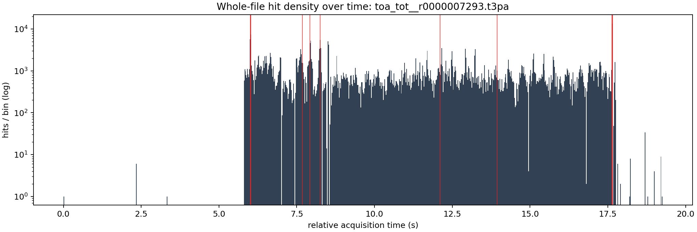

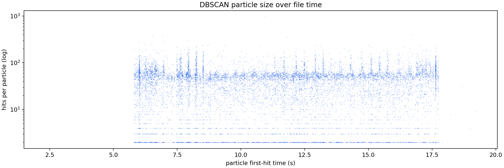

## Densest Time Windows As Equal Cubes

Each window uses real cube scaling: one x pixel, one y pixel, and one fine time bin have the same drawn size. The z axis is local to the selected time window, but the table gives absolute relative acquisition time.

The x/y axes are fixed to the full detector plane `0..256`.
The z axis is fixed to the full selected time slab.

Windows were selected by `particles`.

| rank | start s | span ns | z cube ns | hits | voxels | particles | noise frac | image |
|---:|---:|---:|---:|---:|---:|---:|---:|---|
| 1 | 17.644200 | 40000.0 | 156.2500 | 234 | 234 | 5 | 0.009 | [png](../../assets/native_grid_dbscan_aligned_time_eps5_crowded_08_7293_many_particles_100x_time_fixed_z/whole_file_window_01_z11292288000_11292313600_cubes.png) |
| 2 | 17.649240 | 40000.0 | 156.2500 | 228 | 228 | 5 | 0.000 | [png](../../assets/native_grid_dbscan_aligned_time_eps5_crowded_08_7293_many_particles_100x_time_fixed_z/whole_file_window_02_z11295513600_11295539200_cubes.png) |
| 3 | 6.010600 | 40000.0 | 156.2500 | 208 | 208 | 5 | 0.019 | [png](../../assets/native_grid_dbscan_aligned_time_eps5_crowded_08_7293_many_particles_100x_time_fixed_z/whole_file_window_03_z3846784000_3846809600_cubes.png) |
| 4 | 6.010200 | 40000.0 | 156.2500 | 110 | 110 | 5 | 0.000 | [png](../../assets/native_grid_dbscan_aligned_time_eps5_crowded_08_7293_many_particles_100x_time_fixed_z/whole_file_window_04_z3846528000_3846553600_cubes.png) |
| 5 | 17.635320 | 40000.0 | 156.2500 | 236 | 236 | 4 | 0.004 | [png](../../assets/native_grid_dbscan_aligned_time_eps5_crowded_08_7293_many_particles_100x_time_fixed_z/whole_file_window_05_z11286604800_11286630400_cubes.png) |
| 6 | 6.011040 | 40000.0 | 156.2500 | 205 | 205 | 4 | 0.005 | [png](../../assets/native_grid_dbscan_aligned_time_eps5_crowded_08_7293_many_particles_100x_time_fixed_z/whole_file_window_06_z3847065600_3847091200_cubes.png) |
| 7 | 13.937120 | 40000.0 | 156.2500 | 190 | 190 | 4 | 0.000 | [png](../../assets/native_grid_dbscan_aligned_time_eps5_crowded_08_7293_many_particles_100x_time_fixed_z/whole_file_window_07_z8919756800_8919782400_cubes.png) |
| 8 | 7.926000 | 40000.0 | 156.2500 | 122 | 122 | 4 | 0.008 | [png](../../assets/native_grid_dbscan_aligned_time_eps5_crowded_08_7293_many_particles_100x_time_fixed_z/whole_file_window_08_z5072640000_5072665600_cubes.png) |
| 9 | 6.021720 | 40000.0 | 156.2500 | 120 | 120 | 4 | 0.000 | [png](../../assets/native_grid_dbscan_aligned_time_eps5_crowded_08_7293_many_particles_100x_time_fixed_z/whole_file_window_09_z3853900800_3853926400_cubes.png) |
| 10 | 8.249600 | 40000.0 | 156.2500 | 104 | 104 | 4 | 0.000 | [png](../../assets/native_grid_dbscan_aligned_time_eps5_crowded_08_7293_many_particles_100x_time_fixed_z/whole_file_window_10_z5279744000_5279769600_cubes.png) |
| 11 | 7.683720 | 40000.0 | 156.2500 | 85 | 85 | 4 | 0.000 | [png](../../assets/native_grid_dbscan_aligned_time_eps5_crowded_08_7293_many_particles_100x_time_fixed_z/whole_file_window_11_z4917580800_4917606400_cubes.png) |
| 12 | 12.111880 | 40000.0 | 156.2500 | 80 | 80 | 4 | 0.000 | [png](../../assets/native_grid_dbscan_aligned_time_eps5_crowded_08_7293_many_particles_100x_time_fixed_z/whole_file_window_12_z7751603200_7751628800_cubes.png) |

### Window 1

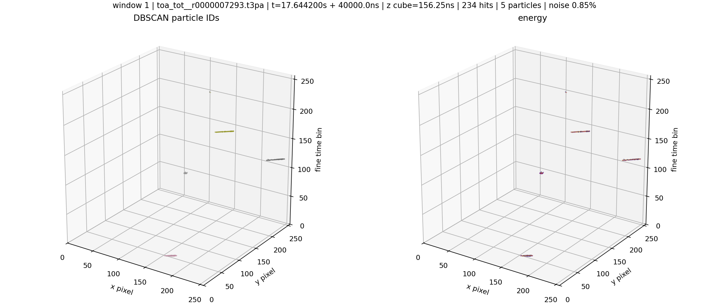

### Window 2

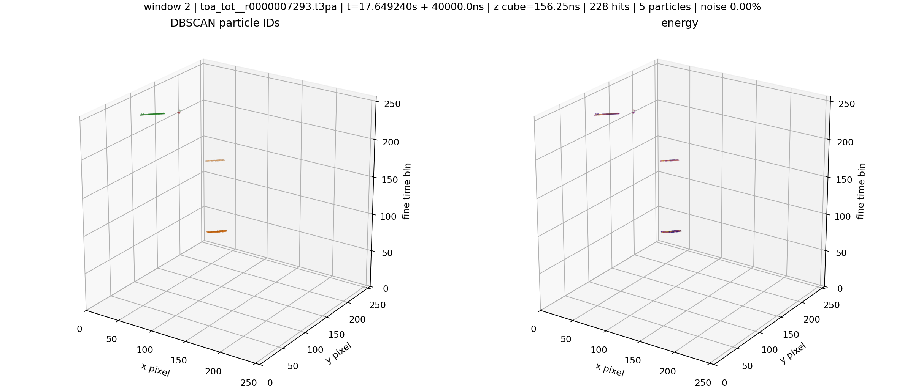

### Window 3

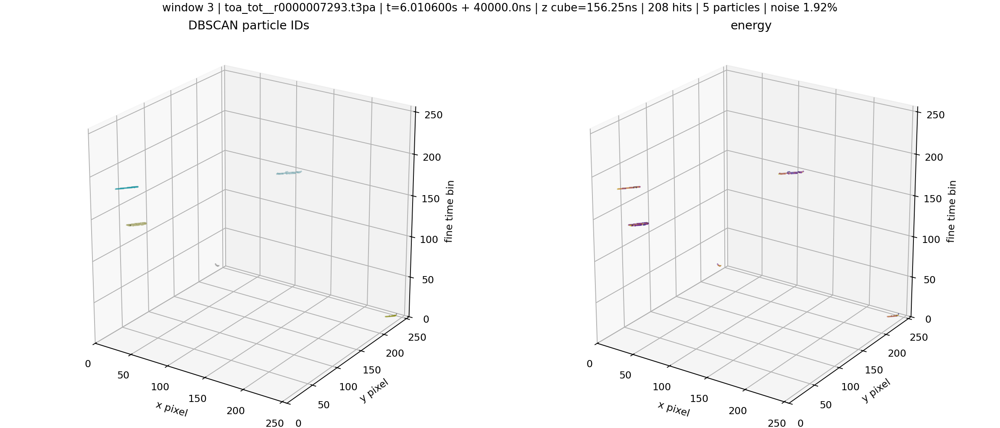

### Window 4

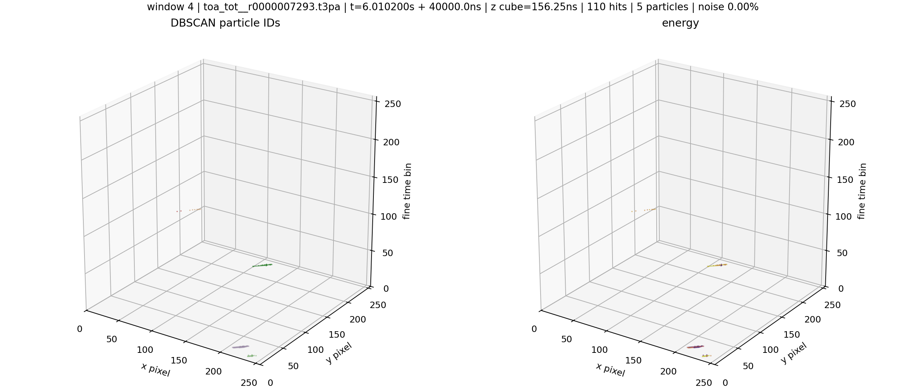

### Window 5

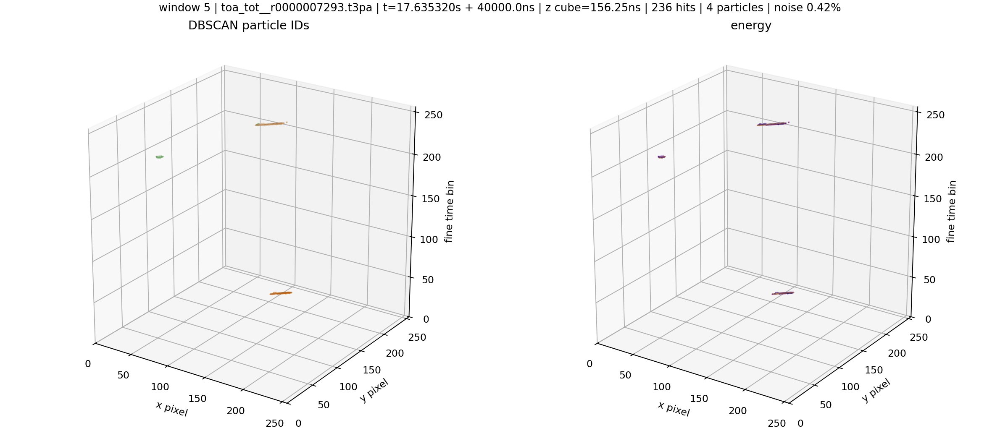

### Window 6

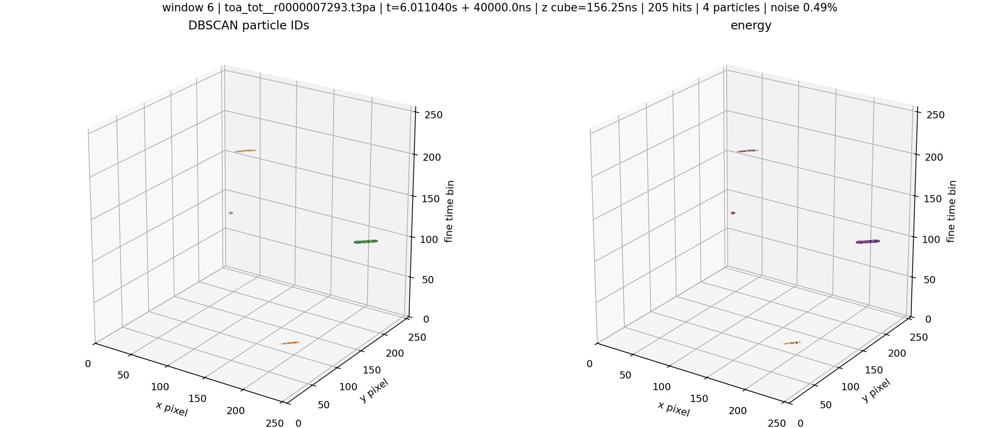

### Window 7

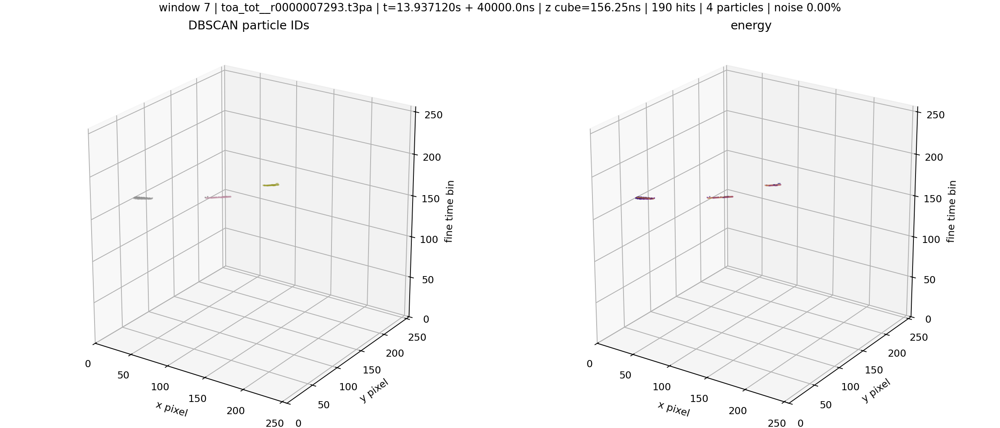

### Window 8

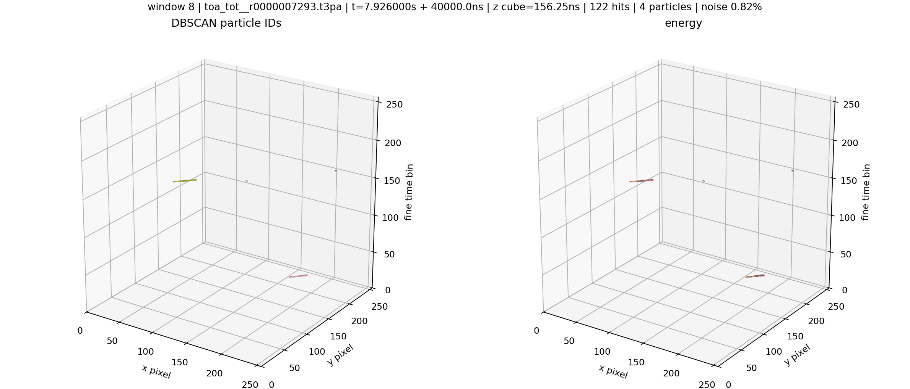

### Window 9

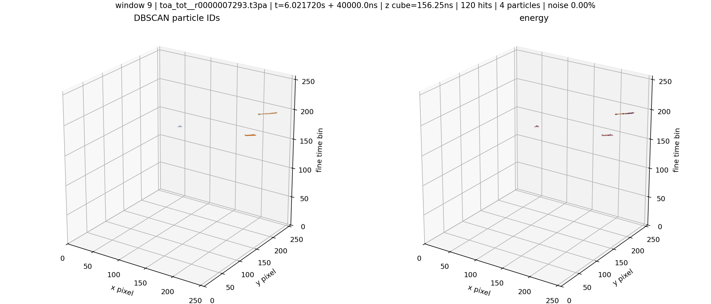

### Window 10

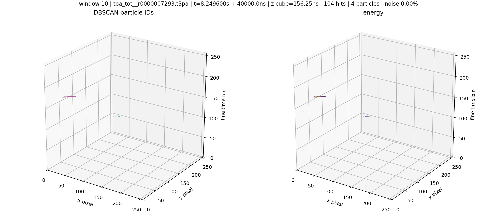

### Window 11

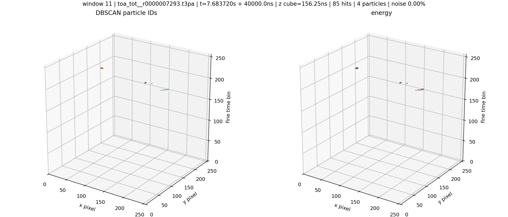

### Window 12

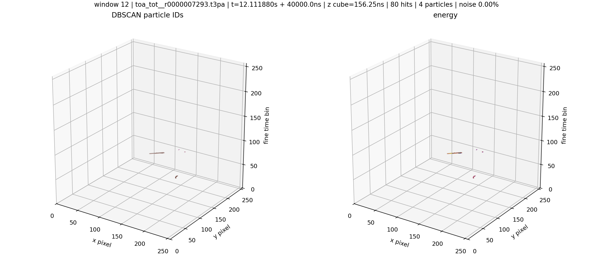
