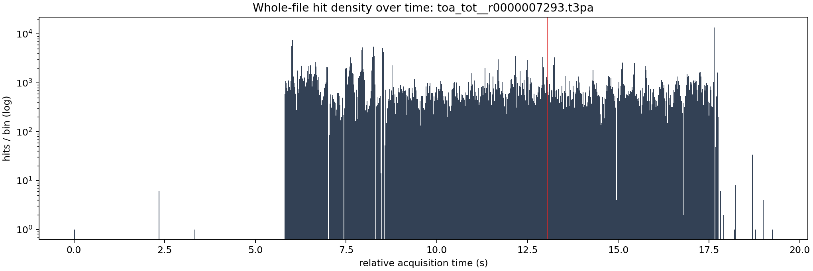
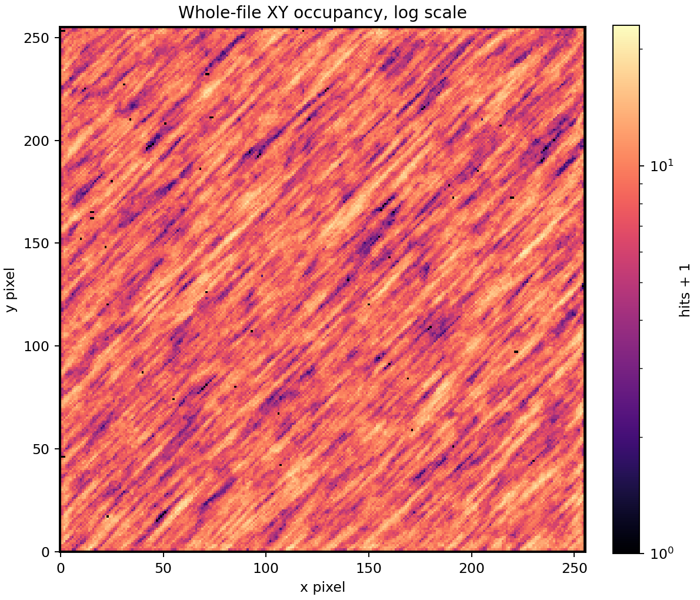
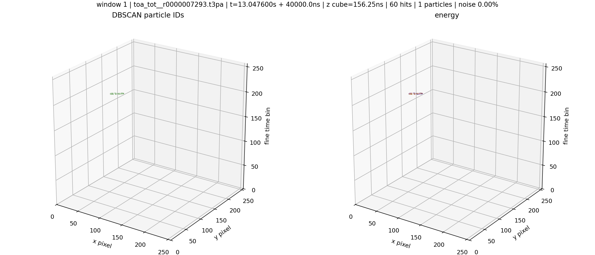

# Aligned-Time eps5 Native DBSCAN Check: Crowded 08 Thu 7293 Window 2

Source shard: `local_data/processed/native_grid_dbscan_crowded_file_v001/particles_aligned_time_eps5_v001/08_thu_proton_daily_batch/toa_tot__r0000007293.particles.npz`

Raw source: `local_data/raw/08_thu_proton_daily_batch/toa_tot__r0000007293.t3pa`

This is a whole-file inspection view. A literal one-image, equal-axis rendering of every cube is not useful because this file spans `12,327,013,936` fine-time bins. The report therefore uses whole-file summaries plus an equal-cube atlas of the densest short time windows.

- hits: `487,940`
- particles: `11,399`
- noise fraction: `0.007`
- fine-time span: `12,327,013,936` bins = `19.261` s
- plotted z cube: `100` fine bins = `156.2500` ns

## Whole-File Context

## Densest Time Windows As Equal Cubes

Each window uses real cube scaling: one x pixel, one y pixel, and one fine time bin have the same drawn size. The z axis is local to the selected time window, but the table gives absolute relative acquisition time.

The x/y axes are fixed to the full detector plane `0..256`.
The z axis is fixed to the full selected time slab.

Windows were selected by `hits`.

| rank | start s | span ns | z cube ns | hits | voxels | particles | noise frac | image |
|---:|---:|---:|---:|---:|---:|---:|---:|---|
| 1 | 13.047600 | 40000.0 | 156.2500 | 60 | 60 | 1 | 0.000 | [png](../../assets/native_grid_dbscan_aligned_time_eps5_crowded_08_7293_window2/whole_file_window_01_z8350464000_8350489600_cubes.png) |

### Window 1

