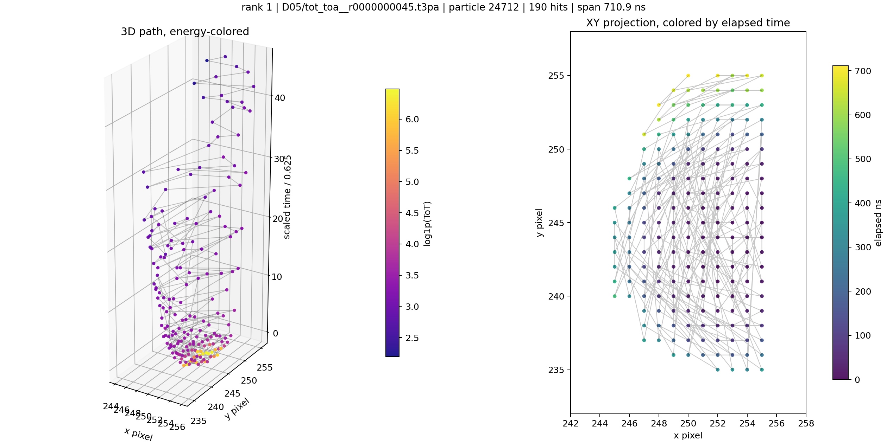
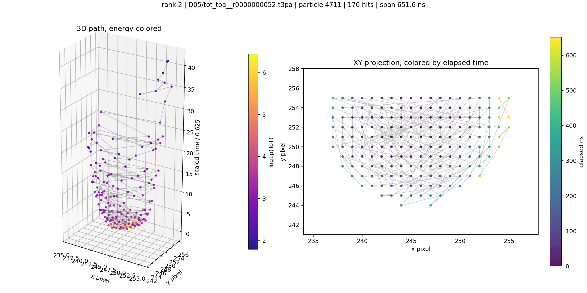
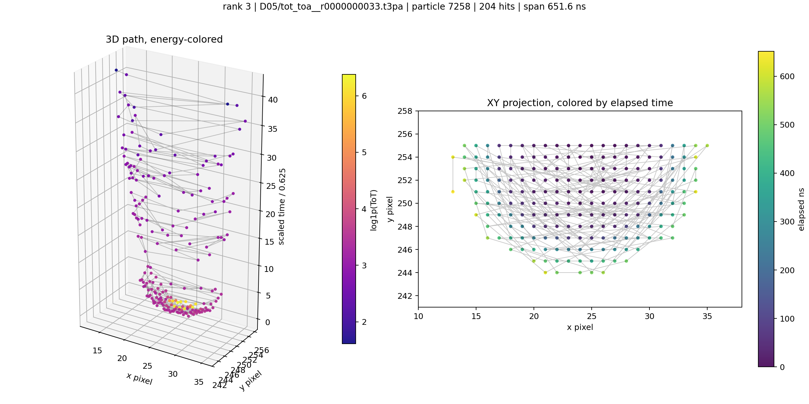
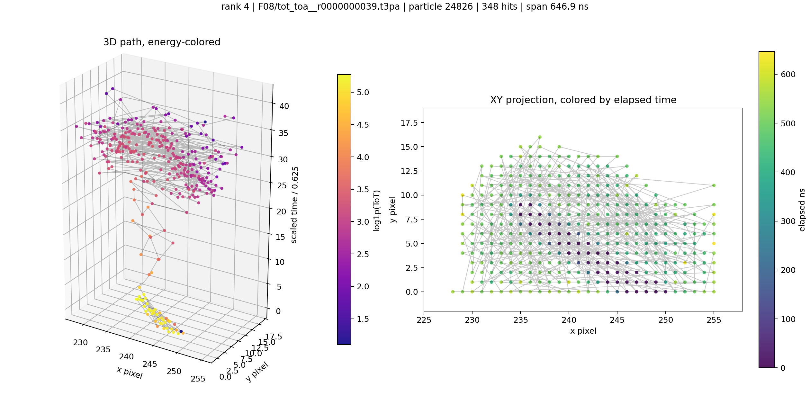
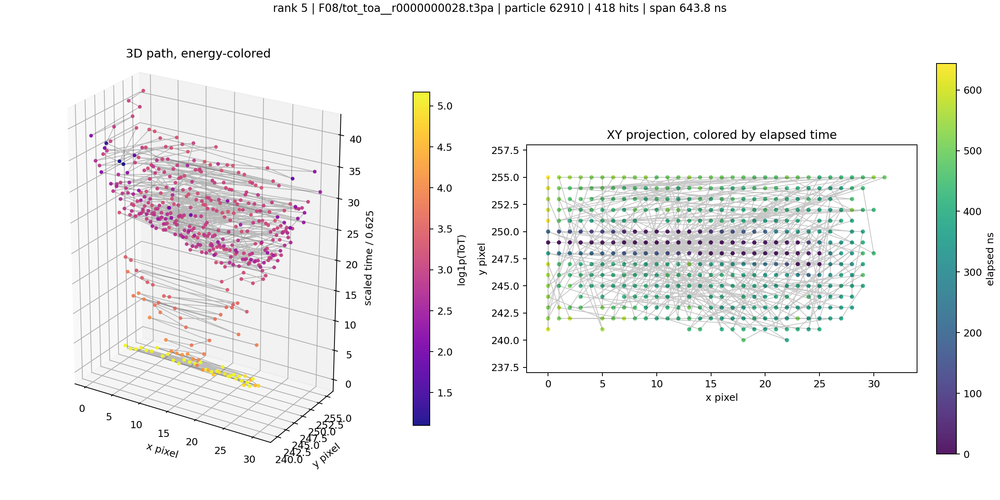
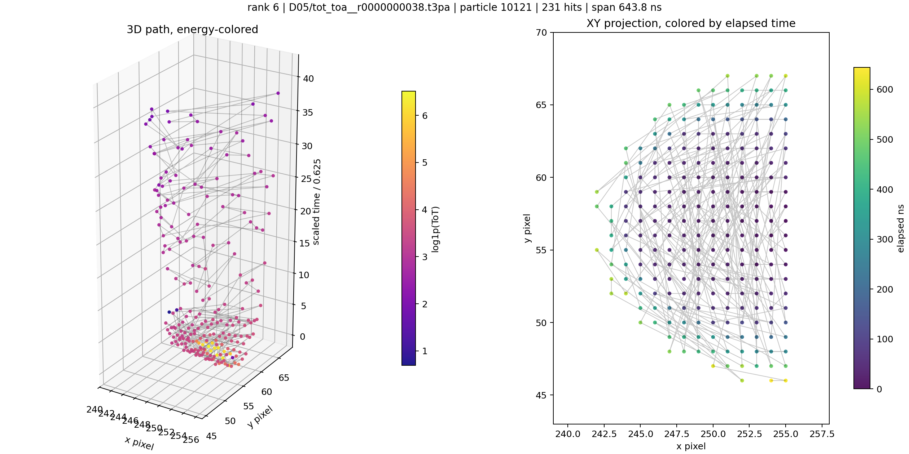
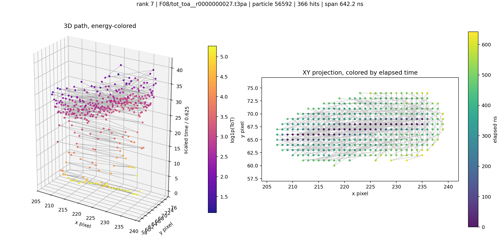
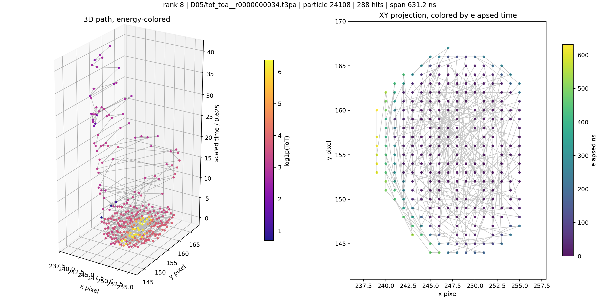

# Aligned-Time eps5 Long-Timespan Particles

This report uses the full all-file reestimate from `local_data/processed/particles_aligned_time_eps5_v001/`.
Ranking is by per-particle `particle_time_max - particle_time_min` using corrected `ToA - FToA / 16` time.

The 3D panels use DBSCAN-scaled time on z: `(hit_time - particle_time_min) / 0.625`. The XY panels are colored by elapsed nanoseconds.

## Reestimate Summary

- Files: `711`
- Raw hits: `44,725,206`
- Particles: `3,464,792`
- Weighted noise fraction: `0.024`
- Slowest file runtime: `36.063 s`

## Longest Timespan Particles

| rank | source | particle | hits | span ns | span ticks | scaled span | energy sum | image |
|---:|---|---:|---:|---:|---:|---:|---:|---|
| 1 | `D05/tot_toa__r0000000045.t3pa` | 24712 | 190 | 710.9 | 28.4375 | 45.50 | 687.4 | [png](../../assets/native_grid_dbscan_aligned_time_eps5_long_timespan_particles/long_timespan_01_tot_toa__r0000000045_p24712.png) |
| 2 | `D05/tot_toa__r0000000052.t3pa` | 4711 | 176 | 651.6 | 26.0625 | 41.70 | 594.6 | [png](../../assets/native_grid_dbscan_aligned_time_eps5_long_timespan_particles/long_timespan_02_tot_toa__r0000000052_p4711.png) |
| 3 | `D05/tot_toa__r0000000033.t3pa` | 7258 | 204 | 651.6 | 26.0625 | 41.70 | 687.9 | [png](../../assets/native_grid_dbscan_aligned_time_eps5_long_timespan_particles/long_timespan_03_tot_toa__r0000000033_p7258.png) |
| 4 | `F08/tot_toa__r0000000039.t3pa` | 24826 | 348 | 646.9 | 25.8750 | 41.40 | 1111.3 | [png](../../assets/native_grid_dbscan_aligned_time_eps5_long_timespan_particles/long_timespan_04_tot_toa__r0000000039_p24826.png) |
| 5 | `F08/tot_toa__r0000000028.t3pa` | 62910 | 418 | 643.8 | 25.7500 | 41.20 | 1331.4 | [png](../../assets/native_grid_dbscan_aligned_time_eps5_long_timespan_particles/long_timespan_05_tot_toa__r0000000028_p62910.png) |
| 6 | `D05/tot_toa__r0000000038.t3pa` | 10121 | 231 | 643.8 | 25.7500 | 41.20 | 787.0 | [png](../../assets/native_grid_dbscan_aligned_time_eps5_long_timespan_particles/long_timespan_06_tot_toa__r0000000038_p10121.png) |
| 7 | `F08/tot_toa__r0000000027.t3pa` | 56592 | 366 | 642.2 | 25.6875 | 41.10 | 1147.6 | [png](../../assets/native_grid_dbscan_aligned_time_eps5_long_timespan_particles/long_timespan_07_tot_toa__r0000000027_p56592.png) |
| 8 | `D05/tot_toa__r0000000034.t3pa` | 24108 | 288 | 631.2 | 25.2500 | 40.40 | 1063.8 | [png](../../assets/native_grid_dbscan_aligned_time_eps5_long_timespan_particles/long_timespan_08_tot_toa__r0000000034_p24108.png) |

### Rank 1

### Rank 2

### Rank 3

### Rank 4

### Rank 5

### Rank 6

### Rank 7

### Rank 8

