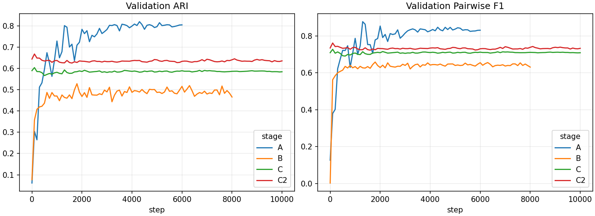
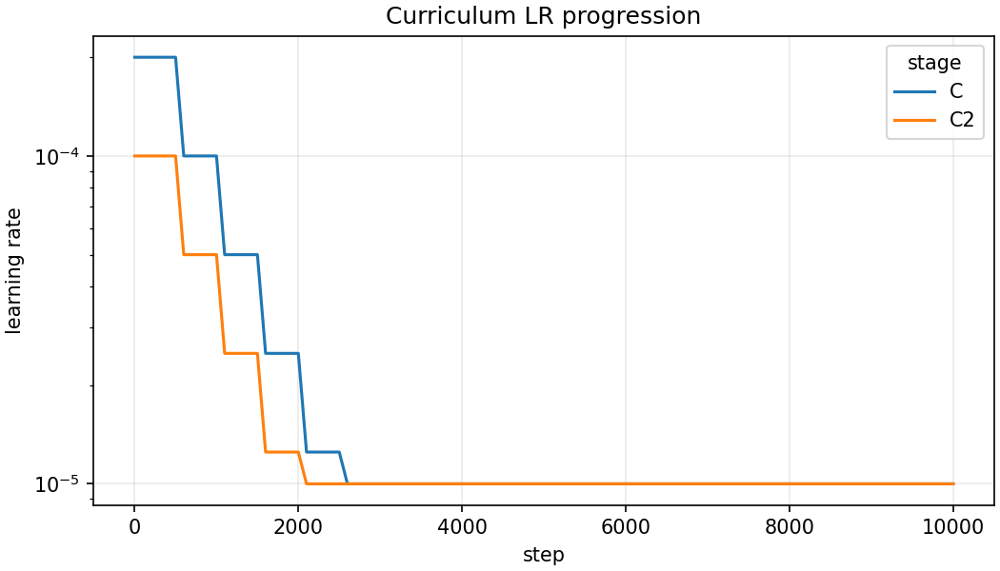
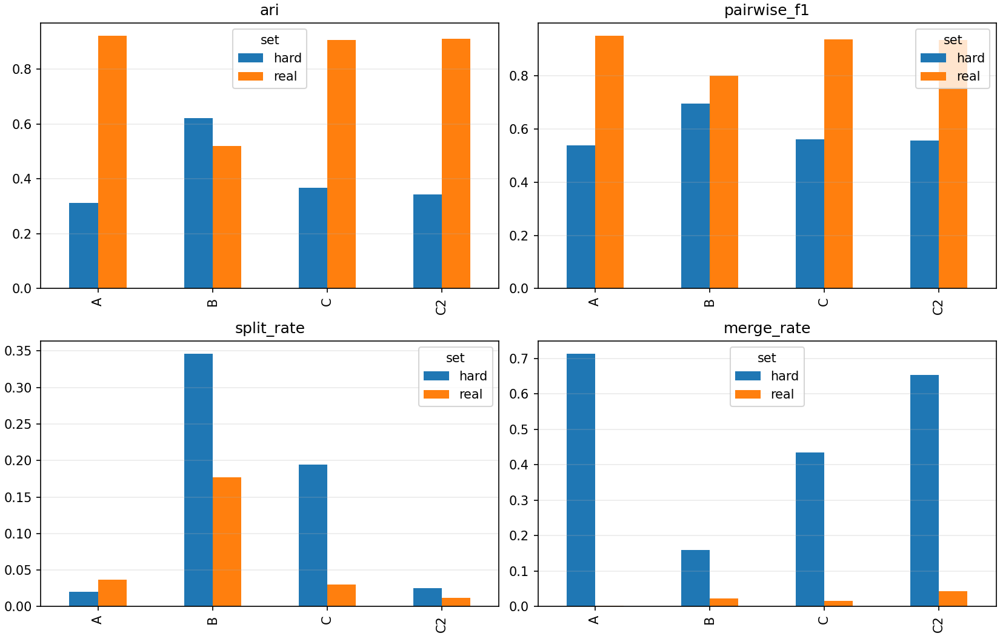
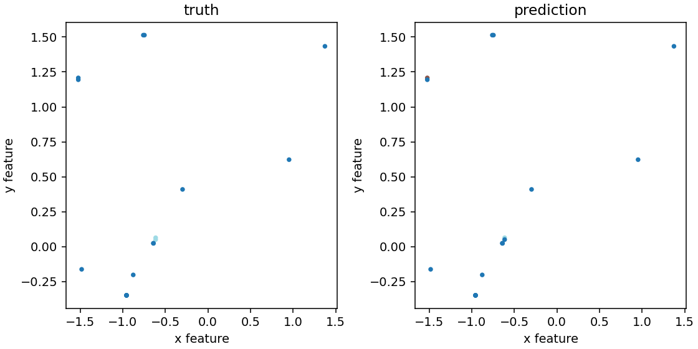
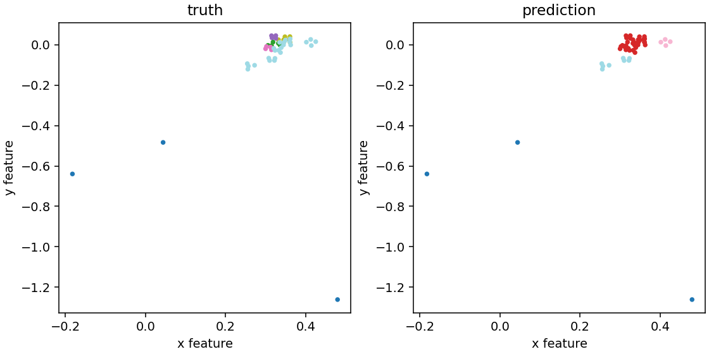
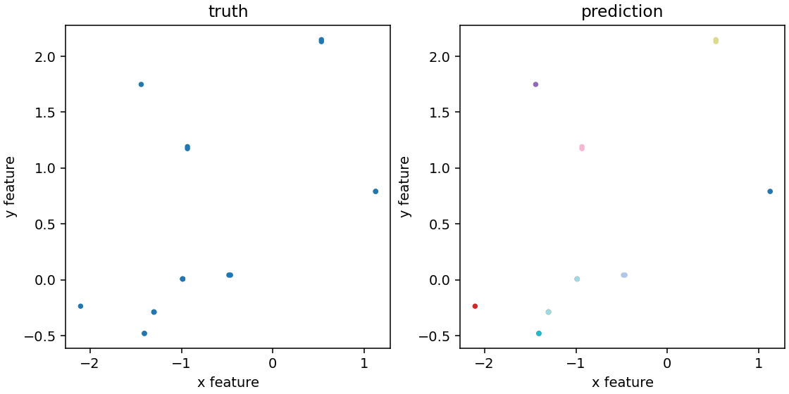
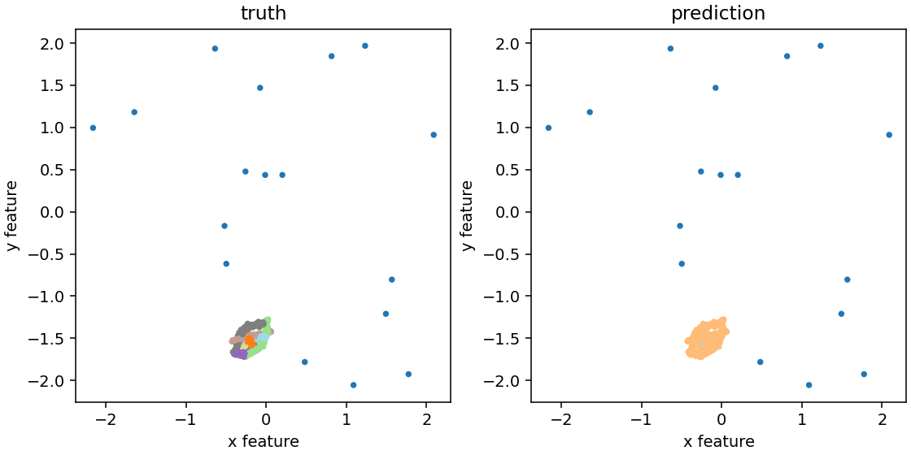
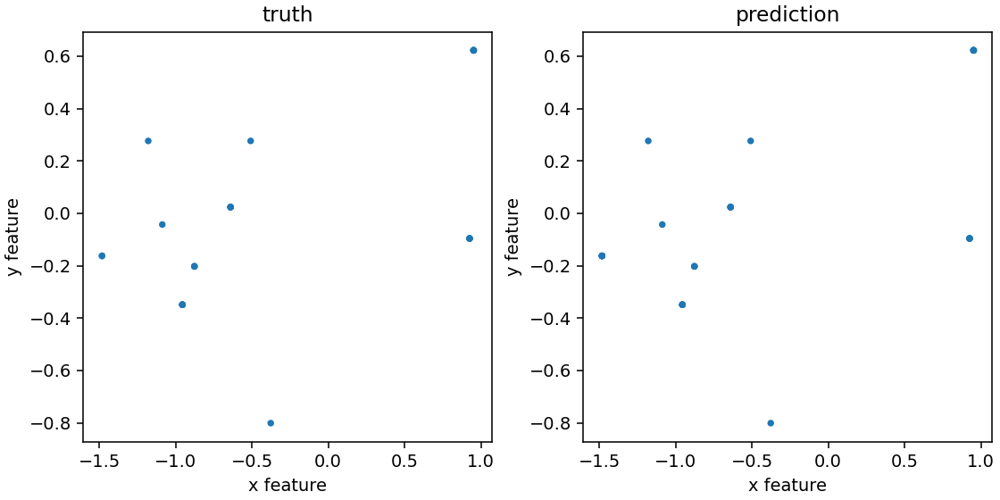
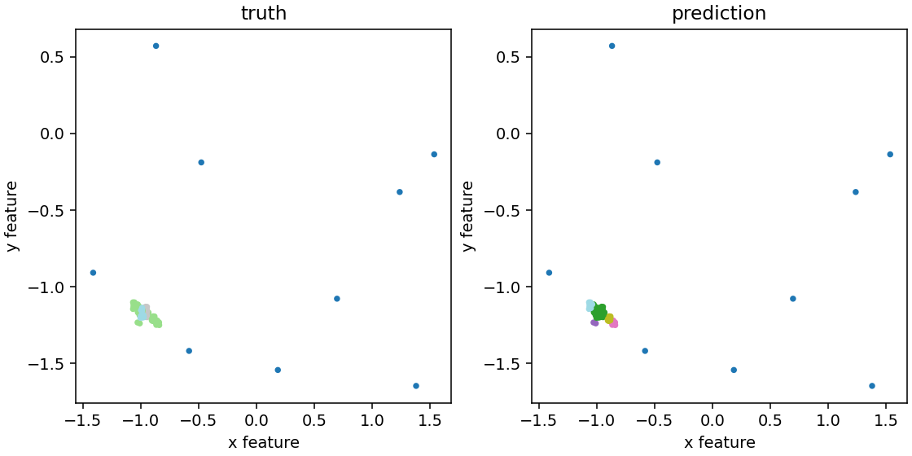
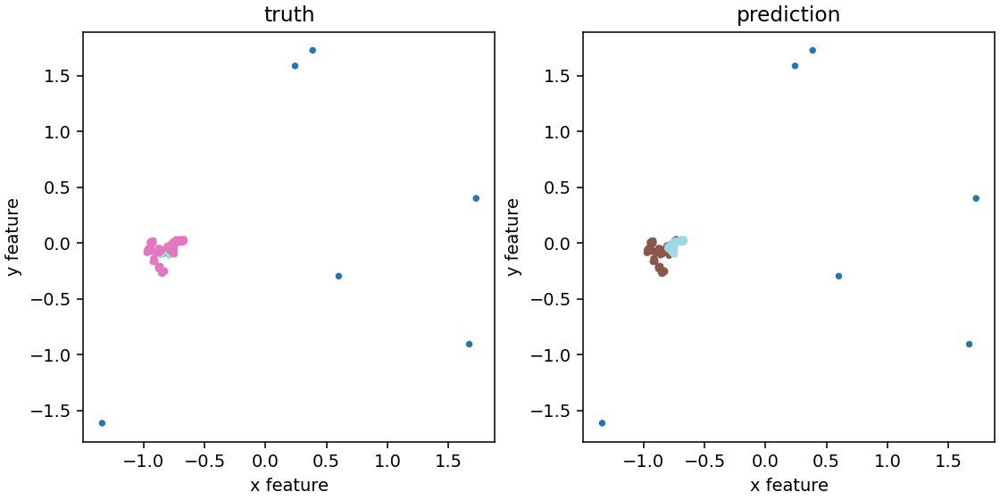

# Phase 1 Full NN Report: DBSCAN Replacement

Status: archived research note. This neural-network separator path is not the
active Phase 1 baseline. The active baseline is now the exact, real-time
`native-grid-dbscan` backend described in
[`phase1-native-grid-baseline.md`](../dbscan/final_eps5/phase1-native-grid-baseline.md).

Generated from local experiment artifacts on 2026-05-03.

## Problem Statement

The Phase 1 goal is to replace the first 3D DBSCAN particle-grouping pass with a neural network that operates directly on variable-size Timepix hit lists. A particle candidate is represented as a sequence of hits containing detector position, time, and energy-like charge information:

```text
(x, y, time, energy)
```

DBSCAN remains the teacher for stable real data, not the target architecture. The NN must preserve every hit and produce particle IDs that can reconstruct ragged particle sequences. Energy is preserved for classification and diagnostics but is not used as a geometric clustering coordinate.

## Data Flow and Label Sources

Raw `.t3pa` files are parsed into hit arrays, then clustered by the frozen `dbscan_v001` teacher into NPZ particle shards. From those shards the pipeline builds training windows:

```text
raw .t3pa
  -> DBSCAN teacher particle shards
  -> real stable DBSCAN windows, label_source=teacher_dbscan
  -> hard mixed synthetic/template windows, label_source=synthetic_truth
  -> curriculum windows for Stage C/C2 fine-tuning
```

The scoring reference column in result tables is the label source. `teacher_dbscan` means the NN is compared with DBSCAN pseudo-labels. `synthetic_truth` means the NN is compared with known generated particle IDs. Those labels are not separate neural networks.

| Dataset | Windows | Train | Val | Test | Notes |
|---|---:|---:|---:|---:|---|
| real stable DBSCAN v001 | 1,043 | 704 | 210 | 129 | source-grouped real windows, stability ARI filtered |
| hard mixed v001 | 12,000 | 8,409 | 1,670 | 1,921 | procedural plus shifted real templates |
| C curriculum 50/50 | 2,086 | 1,408 | 420 | 258 | all real windows plus matched hard windows |
| C2 curriculum 65/35 | 1,604 | 1,083 | 323 | 198 | all real windows plus smaller hard subset |

## Input Window Structure

Each NPZ window stores one ragged graph:

- `features`: normalized node features, shape `[n_hits, 11]`.
- `raw_features`: unnormalized deterministic node features before dataset normalization.
- `edge_index`: directed graph edges, shape `[2, n_edges]`.
- `edge_attr`: deterministic edge features, shape `[n_edges, 14]`.
- `edge_label`: `1` for same particle, `0` for different particles, `-1` for ignored/noise edge.
- `object_label`: per-hit non-noise label.
- `source_particle_id`: reference particle ID per hit, with `-1` for noise.
- `hit_energy`: `log1p(ToT)` energy proxy used for diagnostics and downstream classification.

The 11 node features are:

| Feature | Definition |
|---|---|
| `x_centered` | `(x - 127.5) / 128` |
| `y_centered` | `(y - 127.5) / 128` |
| `t_scaled` | `(ToA - window_ToA_min) / teacher_time_scale` |
| `t_norm` | per-window min-max normalized ToA |
| `log_tot` | `log1p(ToT) / log1p(1023)` |
| `ftoa_norm` | `FToA / 30` |
| `dt_prev_scaled` | clipped previous ToA gap divided by time scale |
| `dt_next_scaled` | clipped next ToA gap divided by time scale |
| `local_density_r2` | neighbor count within radius 2 |
| `local_density_r4` | neighbor count within radius 4 |
| `knn_dist_4` | fourth-nearest neighbor distance in scaled `(x, y, t)` |

The 14 edge attributes are `dx`, `dy`, signed `dt`, `abs_dt`, `dist_xy`, `dist_xyt`, signed `dlogE`, `abs_dlogE`, `logE_ratio`, `same_pixel`, and four edge-type flags. The graph is multi-scale: local radius/kNN edges, medium radius/kNN edges, time-neighbor edges, and same-pixel time-local edges.

## Synthetic and Mixed Data Structure

Hard mixed windows are designed as a stress test, not as an easy training set. They contain:

- shifted real DBSCAN particle templates, preserving hit multiplicity and energy profiles;
- procedural straight, kinked, compact, and dense particle shapes;
- controlled close placement in `(x, y, time)` to create hard negative edges;
- injected noise hits and repeated pixels;
- known `synthetic_truth` labels for every generated particle.

The important difference from real-stable DBSCAN windows is edge balance. Real-stable windows are dominated by easy positive local edges. Hard mixed windows contain many close negative edges, which exposes merge failures in connected-components readout.

## Network Structure

The primary model is `EdgeTrackNetTiny` with this Stage A/C configuration:

| Setting | Value |
|---|---:|
| input_dim | 11 |
| edge_attr_dim | 14 |
| hidden_dim | 128 |
| edge_hidden_dim | 128 |
| message_passing_steps | 2 |
| dropout | 0.05 |
| trainable parameters | 321,538 |

The forward pass is:

1. Encode each hit from 11 input features into a 128-dimensional hidden state with `Linear -> LayerNorm -> SiLU -> Dropout -> Linear -> LayerNorm -> SiLU`.
2. For each message-passing step, build an edge message from `[h_src, h_dst, h_src - h_dst, edge_attr]`.
3. Mean-aggregate messages into destination hits and apply a residual node update.
4. Predict one same-particle edge logit per directed edge.
5. Predict one objectness logit per hit.
6. Convert edge probabilities into particle IDs with bridge-safe connected components.

No custom weight initialization is used. PyTorch `Linear` layers use their default Kaiming-uniform reset; `LayerNorm` starts with scale one and bias zero. Dataset normalization is stored in `normalization.json`, and checkpoints embed the normalization used for evaluation.

## Training and Losses

Training uses AdamW, plateau LR scheduling, focal edge loss, weighted objectness BCE, and optional node embedding metric loss. Stage A uses only real stable DBSCAN pseudo-labels. Stage B uses hard mixed data from scratch. Stages C and C2 fine-tune from the Stage A checkpoint.

| Stage | Trained on | Init | Steps | Best step | Edge/object threshold | Params |
|---|---|---|---:|---:|---|---:|
| A | real stable DBSCAN pseudo-label windows | scratch | 6000 | 4300 | 0.93/0.9 | 321,538 |
| B | hard mixed synthetic/template windows | scratch | 8000 | 1800 | 0.7/0.65 | 439,042 |
| C | Stage A fine-tune on 50/50 real and hard curriculum | Stage A | 10000 | 100 | 0.7/0.9 | 321,538 |
| C2 | Stage A fine-tune on 65/35 real-heavy curriculum | Stage A | 10000 | 100 | 0.7/0.9 | 321,538 |





## External Evaluation

The table below evaluates each neural checkpoint against the original real-stable and hard-mixed test manifests. These are separate scoring references and must not be averaged together.

| Stage | Eval set | Reference labels | ARI | Pairwise F1 | Split | Merge | Object acc. | Energy err. |
|---|---|---|---:|---:|---:|---:|---:|---:|
| A | real stable | `teacher_dbscan` | 0.9233 | 0.9518 | 0.0365 | 0.0024 | 0.9830 | 0.0173 |
| A | hard mixed | `synthetic_truth` | 0.3130 | 0.5388 | 0.0201 | 0.7140 | 0.9967 | 0.0029 |
| B | real stable | `teacher_dbscan` | 0.5198 | 0.8003 | 0.1771 | 0.0225 | 0.7486 | 0.6160 |
| B | hard mixed | `synthetic_truth` | 0.6209 | 0.6959 | 0.3465 | 0.1590 | 0.9990 | 0.0009 |
| C | real stable | `teacher_dbscan` | 0.9081 | 0.9370 | 0.0303 | 0.0160 | 0.9822 | 0.0285 |
| C | hard mixed | `synthetic_truth` | 0.3667 | 0.5624 | 0.1942 | 0.4349 | 0.9982 | 0.0014 |
| C2 | real stable | `teacher_dbscan` | 0.9105 | 0.9352 | 0.0124 | 0.0440 | 0.9829 | 0.0171 |
| C2 | hard mixed | `synthetic_truth` | 0.3426 | 0.5568 | 0.0254 | 0.6536 | 0.9975 | 0.0021 |



## Validation Images

Representative examples are copied from the Phase 1 evaluator. The left subplot is the reference label set and the right subplot is the NN prediction.

| Stage | Real-stable example | Hard-mixed example |
|---|---|---|
| A |  |  |
| B |  |  |
| C |  |  |
| C2 |  |  |

Full local evaluator outputs are under `local_data/experiments/*/evaluation/` and include `summary.json`, `metrics_by_bucket.csv`, `object_iou_metrics.csv`, `edge_pr_curve.csv`, `threshold_sweep.csv`, `latency_cpu.json`, and more failure examples.

## Interpretation

Stage A remains the best deployable Phase 1 checkpoint because it is the only checkpoint that clearly satisfies the real-stable DBSCAN replacement gate with the selected checkpoint thresholds. It reaches real-stable ARI above 0.92 and pairwise F1 above 0.95 while keeping split and merge rates below 0.05.

The curriculum attempts are informative but not successful as replacements. Stage C can pass the real-stable gate only with a different external threshold from its checkpoint-selected threshold, and neither C nor C2 improves hard-mixed performance over Stage B. Stage B remains the strongest hard-mixed checkpoint, but it does not transfer back to real-stable data.

The remaining failure is not raw model size. It is the hard-overlap objective and readout: close particles still merge through plausible high-confidence bridge edges, while higher thresholds fragment some tracks. The next pass should focus on threshold calibration by label source, better hard-negative curriculum sampling, explicit generator buckets, and a learned or more conservative component-splitting readout.

## Reproduction Commands

```bash
particle-build-edge-curriculum-set \
  --real-manifest local_data/processed/pass1_edge_real_stable_v001/manifest.csv \
  --mixed-manifest local_data/processed/pass1_edge_mixed_hard_v001/manifest.csv \
  --normalization local_data/processed/pass1_edge_real_stable_v001/normalization.json \
  --out local_data/processed/pass1_edge_curriculum_v001 \
  --train-real-ratio 0.50 \
  --val-real-ratio 0.50 \
  --test-real-ratio 0.50

particle-train-edge-tracknet \
  --manifest local_data/processed/pass1_edge_curriculum_v001/manifest.csv \
  --out local_data/experiments/phase1_C_curriculum_finetune \
  --init-checkpoint local_data/experiments/phase1_A_real_stable/edge_tracknet_tiny.pt \
  --steps 10000 \
  --min-steps 3000 \
  --batch-size 4 \
  --learning-rate 0.0002 \
  --eval-interval 100 \
  --max-eval-windows 256 \
  --hidden-dim 128 \
  --edge-hidden-dim 128 \
  --message-passing-steps 2 \
  --edge-loss focal \
  --embedding-loss-weight 0.03 \
  --device cuda
```
