# Particle Classification Handout: Phase I Separator And Phase II Embeddings

Status: working handout as of 2026-05-15.

This note summarizes the current repository state for a coworker. The short version is:

- **Phase I is now a custom native 3D DBSCAN separator**, not a neural separator. It is fast enough for the densest local files and is the baseline particle extractor.
- **Phase II is an embedding/compression playground on top of those extracted particles.** The strongest simple model is an 8D clean voxel autoencoder. Rotation-aware models were tested, but explicit rotation disentanglement is still not solved for the voxel model.
- **Latent grouping works as an exploratory morphology tool, not yet as physical particle labeling.** Groups are useful for browsing and representative selection, but direct original-tensor L2 checks show overlap.

## Repository Outputs

Important tracked reports:

- Phase I baseline: [phase1-native-grid-baseline.md](../dbscan/final_eps5/phase1-native-grid-baseline.md)
- Clustering speed report: [clustering-speed-report.md](../dbscan/final_eps5/clustering-speed-report.md)
- Long-timespan particle gallery: [native-grid-dbscan-aligned-time-eps5-long-timespan-particles.md](../dbscan/final_eps5/native-grid-dbscan-aligned-time-eps5-long-timespan-particles.md)
- Approx. 100-particle windows: [native-grid-dbscan-aligned-time-eps5-approx-100-particle-windows.md](../dbscan/final_eps5/native-grid-dbscan-aligned-time-eps5-approx-100-particle-windows.md)
- Simple z8 AE convergence: [phase2-simple-voxel-z8-b1024-clean-fixedmine-20phase-training-convergence.md](../autoencoders/voxel/simple_z8/phase2-simple-voxel-z8-b1024-clean-fixedmine-20phase-training-convergence.md)
- Simple z8 AE gallery: [phase2-simple-voxel-z8-b1024-clean-fixedmine-20phase-gallery.md](../autoencoders/voxel/simple_z8/phase2-simple-voxel-z8-b1024-clean-fixedmine-20phase-gallery.md)
- Latent grouping: [phase2-simple-z8-latent-groups.md](../autoencoders/latent_analysis/phase2-simple-z8-latent-groups.md)
- K=6 group histograms: [phase2-simple-z8-k6-group-histograms.md](../autoencoders/latent_analysis/phase2-simple-z8-k6-group-histograms.md)
- K=6 original-tensor L2 diagnostics: [phase2-simple-z8-k6-original-l2-diagnostics.md](../autoencoders/latent_analysis/phase2-simple-z8-k6-original-l2-diagnostics.md)
- Current similar-latent pair gallery: [phase2-coworker-similar-latent-pairs.md](../autoencoders/latent_analysis/phase2-coworker-similar-latent-pairs.md)

Gitignored local outputs:

- final Phase I particles: `local_data/processed/particles_aligned_time_eps5_v001/`
- Phase II representative voxel cache: `local_data/processed/phase2_voxel_energy_8x32x32_representative_v001/`
- simple z8 checkpoint: `local_data/experiments/phase2_simple_voxel_ae_z8_b1024_clean_fixedmine_20phase_v001/checkpoint.pt`
- latent arrays and KMeans labels: `local_data/experiments/phase2_simple_z8_latent_groups_v001/`

## Phase I: Custom 3D DBSCAN Particle Separator

### Goal

Phase I converts raw Timepix `.t3pa` hit files into separated particle candidates. The output is one NPZ shard per raw file, preserving every hit with `(x, y, time, energy)` and an assigned `particle_id`.

The final baseline is:

```text
native-grid-dbscan
```

This replaces the earlier Phase I neural DBSCAN-replacement attempt. The neural work is archived as research, but the production baseline is the native DBSCAN path.

### Raw Hit Interpretation

Raw `.t3pa` rows contain:

```text
Index, Matrix Index, ToA, ToT, FToA, Overflow
```

The parser converts:

```text
x = MatrixIndex % 256
y = MatrixIndex // 256
hit_time = ToA - FToA / 16
hit_time_ns = 25 * hit_time
hit_energy = log1p(ToT)
```

The fine timestamp correction is important. Earlier experiments using coarse `ToA` alone made time look too blocky and caused misleading particle-continuity checks.

### DBSCAN Distance

DBSCAN uses only 3D geometry:

```text
(x, y, hit_time / time_scale)
```

Energy is **not** used for clustering distance. Energy is preserved for Phase II and later classification.

Final Phase I parameter file:

```text
configs/teachers/dbscan_phase1_native_eps5_v001.json
```

| Parameter | Value | Meaning |
|---|---:|---|
| `eps` | 5.0 | Euclidean radius in `(x, y, scaled time)` |
| `min_samples` | 2 | a core point needs itself plus one neighbor |
| `time_scale` | 0.625 ToA ticks | one DBSCAN time unit is 15.625 ns |
| `window_size` | 250,000 hits | large-file time-window size |
| `window_overlap` | 25,000 hits | overlap used to merge clusters across windows |
| backend | `native-grid-dbscan` | C/OpenMP custom backend |

Because `time_scale = 0.625`, the DBSCAN condition along time alone is:

```text
abs(delta_time) <= eps * time_scale = 3.125 ToA ticks = 78.125 ns
```

### How The Native Backend Works

The native backend is a custom exact DBSCAN implementation specialized for the detector grid.

It uses fixed facts about the data:

- detector plane is a fixed `256 x 256` integer pixel grid;
- `x` and `y` are integer pixels;
- only nearby pixels can be within an `eps=5` ball;
- time is already sorted or sortable;
- DBSCAN connectivity can be represented by union-find.

Algorithm sketch:

1. Parse raw hits into contiguous arrays: `x`, `y`, `hit_time`, `ToT`, `FToA`.
2. Scale time: `t_scaled = hit_time / time_scale`.
3. Sort/index hits by scaled time.
4. Precompute possible `(dx, dy, dt_max)` offsets allowed by `eps`.
5. Use pixel/time buckets to search only local neighbors.
6. Mark core points where neighbor count is `>= min_samples`.
7. Union core-core neighbors into connected components.
8. Assign border points to neighboring core components.
9. Leave unassigned hits as noise label `-1`.
10. For huge files, run overlapping time windows and merge labels across overlap hits.

The native result does **not** call scikit-learn DBSCAN, SciPy KDTree, HDBSCAN, or another external clustering library. SciPy/Numba variants remain benchmark references.

### Output Particle Shards

Final all-file output:

```text
local_data/processed/particles_aligned_time_eps5_v001/
```

Each NPZ stores:

```text
hit_x, hit_y, hit_time, hit_energy, hit_tot, hit_ftoa, hit_source_row
hit_particle_id
particle_offsets
particle_id, particle_n_hits
particle_energy_sum
particle_time_min/max
particle_x_min/max
particle_y_min/max
labels_by_source_row
params_json, source_path
```

This is the data source used for current Phase II preparation.

### Full Dataset Reestimate

| Metric | Result |
|---|---:|
| `.t3pa` files processed | 711 / 711 |
| raw hits processed | 44,725,206 |
| estimated particles | 3,464,792 |
| weighted noise fraction | 0.024 |
| slowest/largest file runtime | 36.063 s |
| largest file particle count | 537,790 |

The highest-runtime files after final realignment:

| File | Hits | Particles | Noise frac | Runtime |
|---|---:|---:|---:|---:|
| `data I05/sync__I05-W0044_r001.t3pa` | 6,275,049 | 537,790 | 0.034 | 36.063 s |
| `data I05/sync__I05-W0044_r000.t3pa` | 5,515,566 | 452,993 | 0.031 | 31.564 s |
| `F08/tot_toa__r0000000052.t3pa` | 2,452,962 | 91,244 | 0.006 | 13.160 s |
| `F08/tot_toa__r0000000028.t3pa` | 2,326,137 | 86,280 | 0.006 | 12.351 s |
| `data I05/sync__I05-W0044_r002.t3pa` | 2,156,669 | 187,117 | 0.035 | 12.209 s |

### Throughput And Real-Time Ratio

The final manifest runtime includes parsing, clustering, and NPZ writing.

| Case | File | Hits | Physical duration | Runtime | RT fraction | Speed |
|---|---|---:|---:|---:|---:|---:|
| densest hit-rate file | `data I05/sync__I05-W0044_r002.t3pa` | 2,156,669 | 15.632 s | 12.209 s | 0.781 | 1.28x real time |
| largest file | `data I05/sync__I05-W0044_r001.t3pa` | 6,275,049 | 59.789 s | 36.063 s | 0.603 | 1.66x real time |
| slow dense F08 file | `F08/tot_toa__r0000000052.t3pa` | 2,452,962 | 19.996 s | 13.160 s | 0.658 | 1.52x real time |

The backend benchmark before full NPZ writing showed the native exact backend is about `9x` faster than the generic SciPy `ckdtree-pairs` exact backend on the largest file:

| Case | Backend | Kind | Hits | Runtime | Hits/s | RT ratio | Speedup vs `ckdtree-pairs` |
|---|---|---|---:|---:|---:|---:|---:|
| largest | `ckdtree-pairs` | exact DBSCAN | 6,275,049 | 219.761 s | 28,554 | 3.68 | 1.00x |
| largest | `numba-grid-dbscan` | exact DBSCAN | 6,275,049 | 24.888 s | 252,132 | 0.42 | 8.83x |
| largest | `native-grid-dbscan` | exact DBSCAN | 6,275,049 | 24.134 s | 260,009 | 0.40 | 9.11x |
| slowest per hit | `native-grid-dbscan` | exact DBSCAN | 2,452,962 | 8.285 s | 296,073 | 0.41 | 13.19x |

Exact-backend validation in the benchmark gave ARI `1.0` and same-noise fraction `1.0` versus the `ckdtree-pairs` reference on all benchmark cases. That confirms implementation agreement, not physical correctness by itself.

### Visual Separator Checks

The final visual checks were done after fine-time correction and eps5 realignment.

Long-timespan particles:


Approx. 100-particle windows:


Interpretation: Phase I now looks healthy enough to serve as the separator baseline. It is still a DBSCAN teacher, so overlapping/crossing particles can remain ambiguous, but the obvious file-scale percolation failure from the old `dbscan_v001` config is gone.

## Phase II: Particle Embedding And Autoencoder Experiments

### Goal

Phase II takes already-separated particles and learns compact representations useful for:

- reconstruction/compression,
- morphology browsing,
- clustering into unsupervised families,
- later supervised classification once labels or inspected families exist.

The current Phase II work should **not** be presented as finished physical particle classification. It is an embedding and compression testbed.

### Phase II Dataset Preparation

Source:

```text
local_data/processed/particles_aligned_time_eps5_v001/
```

The current compact voxel cache:

```text
local_data/processed/phase2_voxel_energy_8x32x32_representative_v001/
```

Dataset size:

| Split | Particles |
|---|---:|
| train | 757,765 |
| validation | 66,022 |
| test | 176,213 |
| total | 1,000,000 |

The cache is representative, not simply the first million particles. It was selected from `3,464,792` Phase I particles and includes source-grouped splits to avoid train/test leakage by raw file.

### Voxel Input Format

For the current voxel autoencoders, each particle becomes one sparse centered tensor:

```text
[T, Y, X] = [8, 32, 32]
```

Values are summed normalized log energy:

```text
voxel_value = sum(log1p(ToT) / log1p(1023))
```

Centering:

```text
center_x = (min_x + max_x) / 2
center_y = (min_y + max_y) / 2
center_t = (min_time + max_time) / 2
```

Voxelization:

```text
x_idx = floor((x - center_x) / 2.0 + 32 / 2)
y_idx = floor((y - center_y) / 2.0 + 32 / 2)
t_idx = floor((hit_time - center_t) / 2.5 + 8 / 2)
```

Hits outside the centered crop are ignored and tracked via `kept_fraction` and `kept_energy_fraction`. The grid is intentionally compact: it trades resolution for fast training and small tensors.

## Autoencoder A: General Simple Voxel AE, No Rotation Factorization

This is the currently most useful compact neural embedding for grouping.

Checkpoint:

```text
local_data/experiments/phase2_simple_voxel_ae_z8_b1024_clean_fixedmine_20phase_v001/checkpoint.pt
```

### Architecture

The model is `VoxelPatchMLPAutoencoder` with no explicit pose or transform head.

| Item | Value |
|---|---:|
| input/output | `[8, 32, 32]` |
| latent | `z_shape` only |
| latent dimension | 8 |
| patch size | `[4, 8, 8]` |
| patch hidden dim | 192 |
| patch embedding dim | 32 |
| global hidden dim | 768 |
| trainable parameters | 2,294,952 |
| output activation | ReLU |
| loss | plain tensor L2 |

Flow:

```text
voxel tensor
  -> patch MLP encoder
  -> global MLP encoder
  -> z_shape[8]
  -> global MLP decoder
  -> patch MLP decoder
  -> reconstructed voxel tensor
```

There is no rotation correction and no physical meaning assigned to individual latent dimensions. The 8D vector is simply the bottleneck learned for reconstruction.

### Training Summary

This run used clean data after earlier noised/blurred experiments. It initialized from the previous b512 half-corruption fixed-mine run, then disabled corruption entirely.

| Metric | Value |
|---|---:|
| batch size | 1024 |
| phases | 20 |
| optimizer steps | 180,736 |
| wall time | 8.17 min |
| best step | 6,144 |
| best validation L2 | 1.476723 |
| clean test L2 | 1.247952 |
| clean test p95 L2 | 2.237494 |
| clean test mass overlap | 0.5899 |
| clean test energy relative L1 | 0.2008 |

The best checkpoint was early. Later fixed-subset training overfit and validation degraded.

Convergence:


Reconstruction examples:

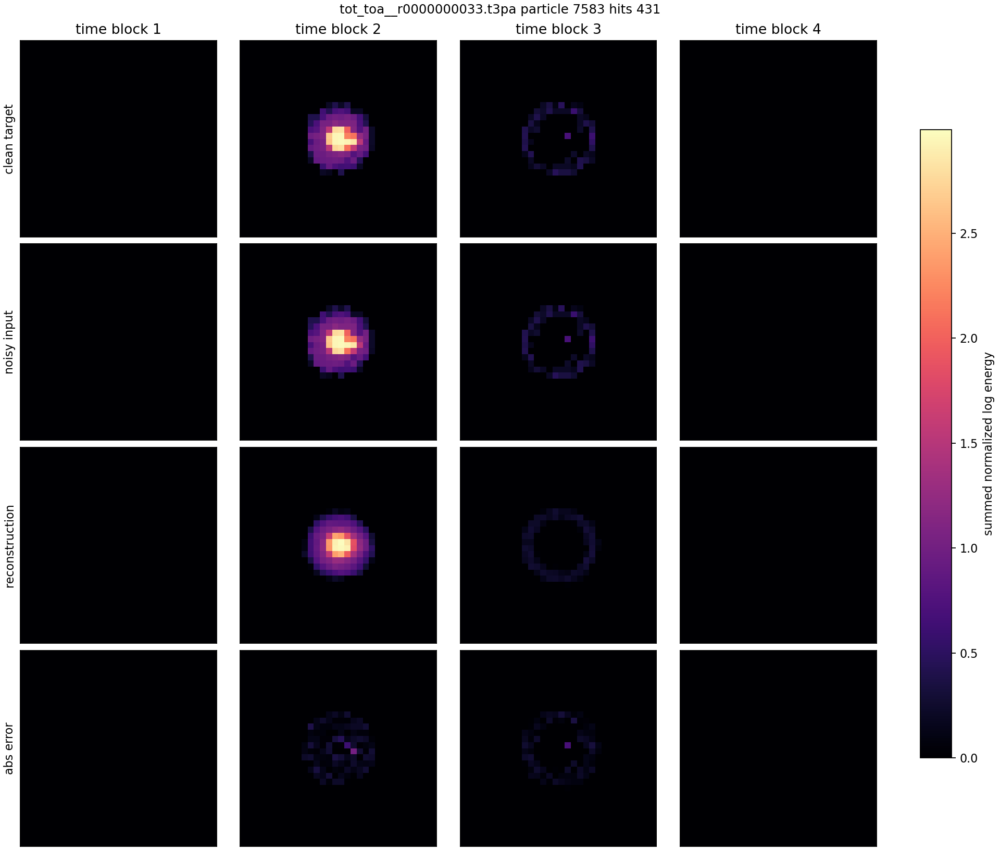

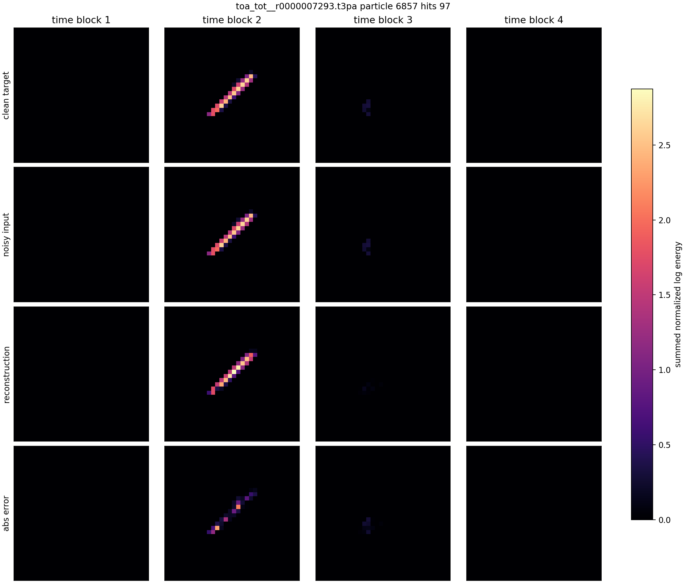

Interpretation: this is useful for rough morphology embedding, but it is not near-lossless. Reconstruction is often shape-plausible, but energy and fine details remain imperfect.

## Autoencoder B: Rotation-Aware / Pose-Separated Experiments

Several rotation-aware designs were tried. The cleanest conceptual design is the pose-separated path autoencoder; the voxel transform experiment is also important because it shows what failed.

### Pose-Separated Path Autoencoder

Report:

[phase2-pose-separated-autoencoder.md](../autoencoders/path/phase2-pose-separated-autoencoder.md)

This representation is not the `[8,32,32]` voxel tensor. It converts each particle to a time-ordered path:

```text
[128, 4] = (x, y, t_norm, energy)
```

Design:

1. Compute weighted PCA in the detector plane.
2. Store `theta_xy` as explicit pose metadata: `cos(theta_xy)`, `sin(theta_xy)`, `q_theta`.
3. Rotate the path into canonical XY orientation.
4. Encode only the canonical path into `z_shape`.
5. Decode the canonical path.
6. Apply a fixed, non-learned XY rotation matrix at the end.

This matches the intended contract: detector-plane rotation is metadata, not class morphology.

Selected results:

| Model | Latent | Test energy-path relative L2 | Test path relative L2 |
|---|---:|---:|---:|
| stronger neural path AE | 8 | 0.1365 | 0.1622 |
| stronger neural path AE | 16 | 0.0968 | 0.1137 |
| implicit sweep | 128 | 0.0674 | 0.0786 |
| conv hifi neural | 256 | 0.0438 | 0.0501 |
| PCA/basis baseline | 320 | 0.0090 | n/a |
| PCA/basis baseline | 384 | 0.0054 | n/a |

Figures:

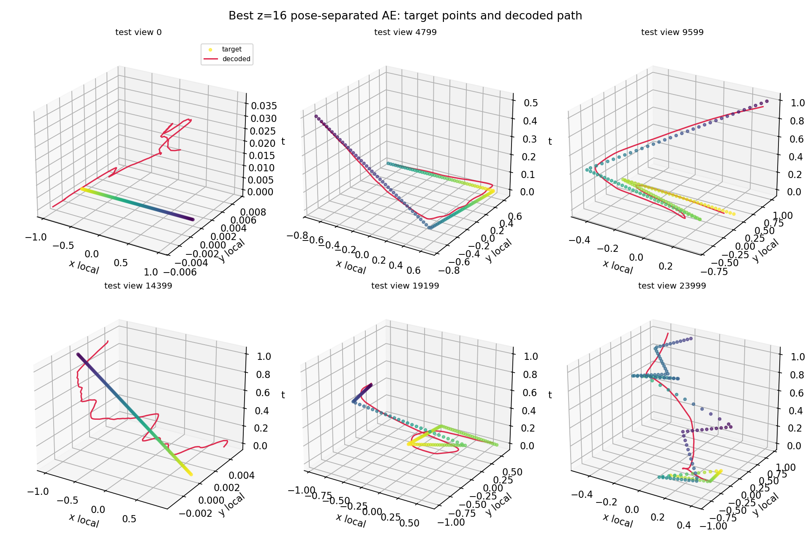

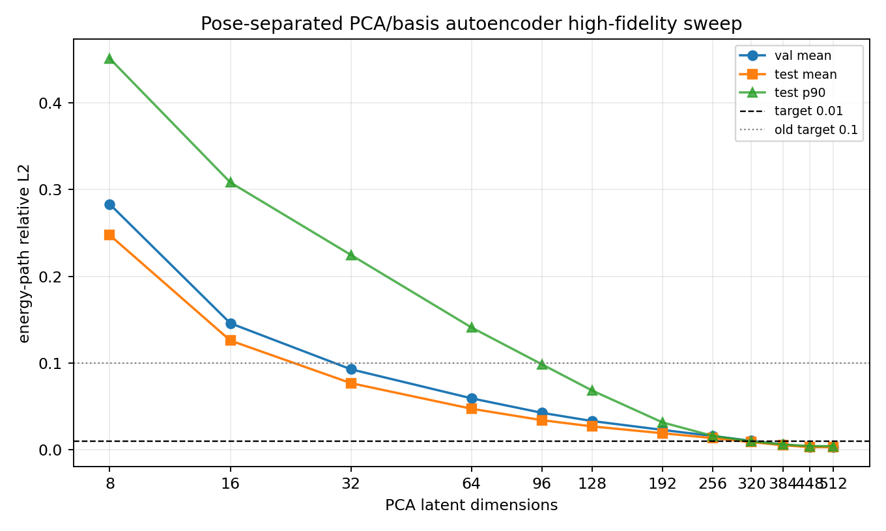

Interpretation:

- `8-16` dimensions are useful as small morphology embeddings, but not enough for near-lossless path reconstruction.
- Near-`<0.01` reconstruction is achievable with a much larger PCA/basis latent around `320-384`.
- This supports the idea that rotation should be separated, but it also shows the information bottleneck is real.

### Voxel Transform AE With `theta_xy`

The voxel transform family tried to use:

```text
decoder(z_shape) -> canonical voxel tensor
transform_layer(theta_xy, energy_scale, ...) -> final reconstruction
```

The best recent constrained version used only `theta_xy` and `energy_scale` as explicit transform outputs:

```text
local_data/experiments/phase2_canonical_voxel_ae_compressed_plain_l2_wide_z24_depth_xyenergy_b512_v001/checkpoint.pt
```

| Item | Value |
|---|---:|
| input/output | `[8, 32, 32]` |
| shape latent | 24 |
| explicit transform variables | `theta_xy`, `energy_scale` |
| fixed transform variables | `dx=0`, `dy=0`, `dt=0`, `theta_time_tilt=0`, `scale_xyz=1` |
| hidden dim | 2048 |
| patch hidden/embed | 512 / 96 |
| trainable parameters | 25,665,914 |
| best validation plain L2 | 1.701953 |
| corrupted test L2 | 1.301696 |
| clean test L2 | 2.995963 |
| corrupted test mass overlap | 0.7825 |

Reconstruction examples:


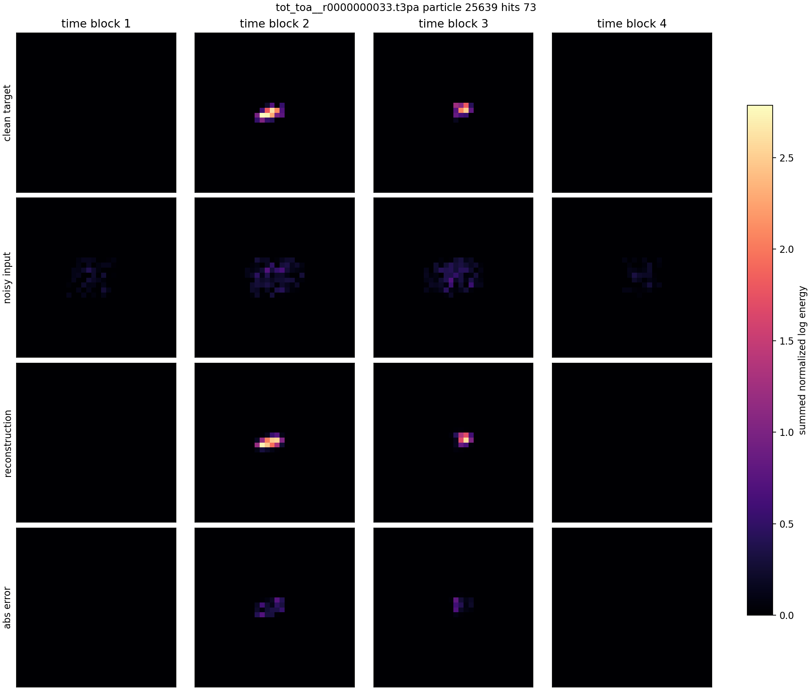

Important caveat:

The learned `theta_xy` transform head collapsed near pi. A pair search requiring model `theta_xy` difference of at least 1 rad found no pairs:


Interpretation: the voxel transform model can reconstruct, but it did **not** successfully force rotation into the explicit transform variable. Orientation still leaks into `z_shape` or the decoder.

## Latent Grouping

The current grouping uses the clean simple z8 voxel autoencoder.

Process:

1. Encode all `1,000,000` representative particles into `z_shape[8]`.
2. Standardize `z_shape` to `z_norm`.
3. Run MiniBatchKMeans.
4. Inspect K sweeps, prototypes, K=6 coarse histograms, and original-tensor L2 diagnostics.

### K Sweep

| K | Silhouette sample | Davies-Bouldin | Calinski-Harabasz | Min cluster | Max cluster | Median cluster |
|---:|---:|---:|---:|---:|---:|---:|
| 8 | 0.1691 | 1.4076 | 3572.2 | 13,393 | 384,346 | 63,051.5 |
| 16 | 0.1136 | 1.4849 | 2572.1 | 12,191 | 199,776 | 38,311.5 |
| 24 | 0.1457 | 1.4889 | 2135.5 | 8,933 | 226,113 | 24,353.5 |
| 32 | 0.1238 | 1.4996 | 1848.2 | 3,001 | 180,646 | 18,170.0 |
| 48 | 0.1172 | 1.6383 | 1436.4 | 2,287 | 150,774 | 11,002.0 |
| 64 | 0.1215 | 1.6350 | 1228.6 | 1,998 | 138,699 | 9,688.0 |

K=8 is the cleanest coarse grouping by silhouette. K=32 is more useful for visual inspection because it splits the large families into manageable prototype groups.

Latent PCA and grouping plots:

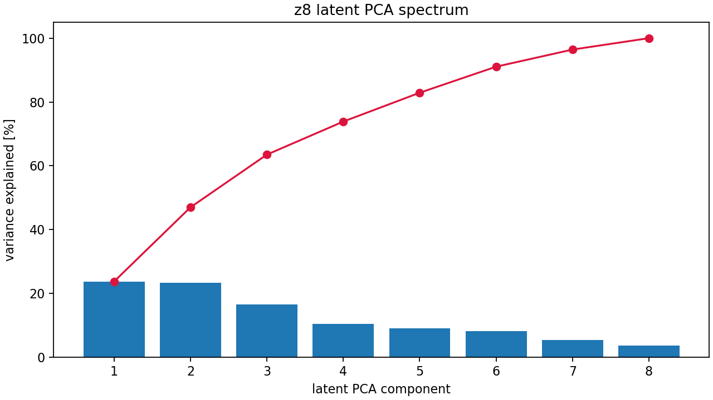

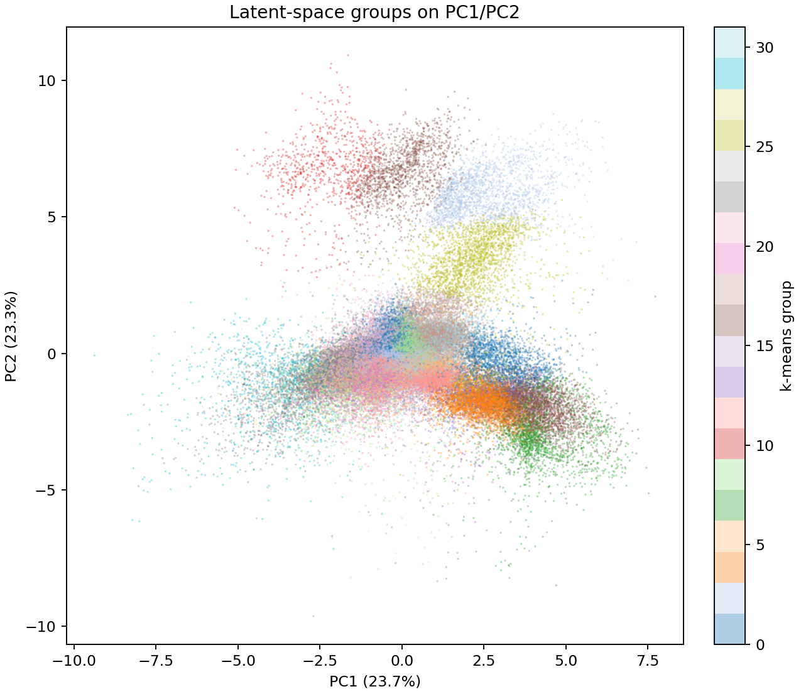

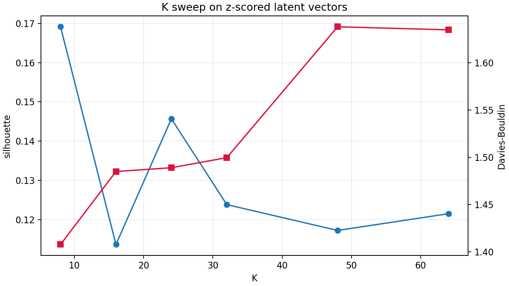

### K=32 Prototype Examples

These are medoid particles from the largest K=32 latent groups:


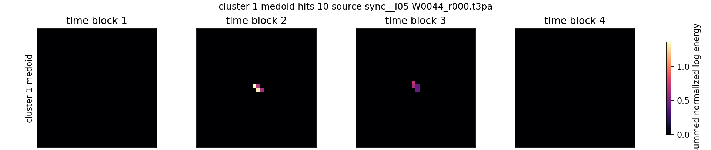

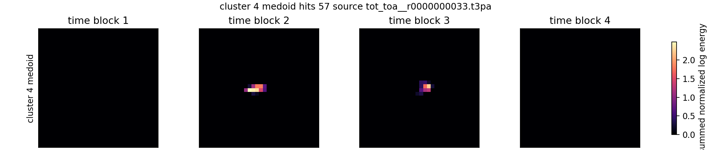

### K=6 Coarse Grouping

K=6 was used to inspect broad modes. The groups are strongly imbalanced:

| Group | Count | Fraction |
|---:|---:|---:|
| 0 | 650,592 | 65.06% |
| 1 | 35,717 | 3.57% |
| 2 | 40,727 | 4.07% |
| 3 | 30,658 | 3.07% |
| 4 | 198,889 | 19.89% |
| 5 | 43,417 | 4.34% |

K=6 group histograms:


Numerical subgroup diagnostics found internal structure in the broad groups. For example, group 3 is visually multi-lobed and numerically not a single clean blob:

| Group | Best silhouette K | Best DB K | Inertia elbow K | Practical inspection K |
|---:|---:|---:|---:|---:|
| 0 | 6 | 11 | 4 | 6 |
| 1 | 2 | 2 | 3 | 2 |
| 2 | 6 | 6 | 6 | 6 |
| 3 | 2 | 3 | 3 | 2 |
| 4 | 2 | 11 | 4 | 2 |
| 5 | 2 | 5 | 5 | 2 |

### Original Tensor L2 Check

To test whether the latent groups are genuinely similar in the original voxel space, I measured L2 distances between original `[8,32,32]` tensors, not reconstructions.

Overall sample silhouette in original tensor space:

| Metric | Value |
|---|---:|
| raw original tensor silhouette | 0.0297 |
| unit-sum original tensor silhouette | 0.0254 |

Interpretation: the latent groups have some structure, but they overlap strongly under direct original-tensor L2. They are better viewed as reconstruction-latent groups than as a finished physical taxonomy.

Original-L2 plots:

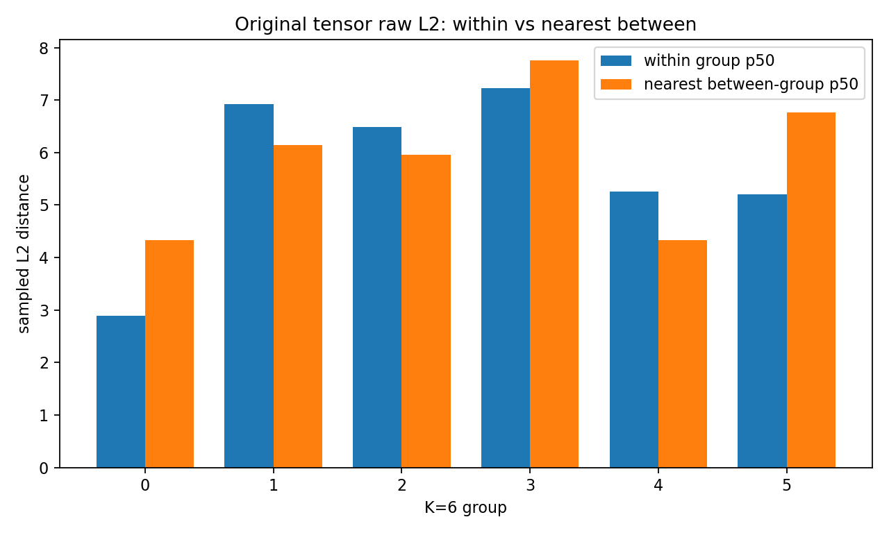

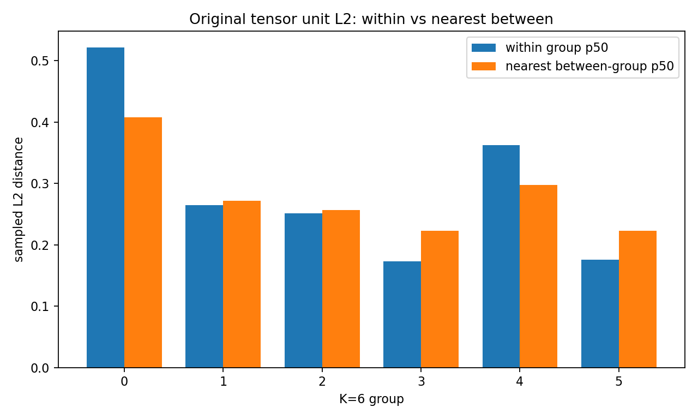

## Similar-Latent Particle Pair Gallery

The following pairs were selected from the current clean simple z8 model. For each of the largest K=32 latent groups, the search found a nearest-neighbor pair in standardized `z_shape` space, requiring different source files and at least 10 hits.

Full gallery:

[phase2-coworker-similar-latent-pairs.md](../autoencoders/latent_analysis/phase2-coworker-similar-latent-pairs.md)

Example pairs:

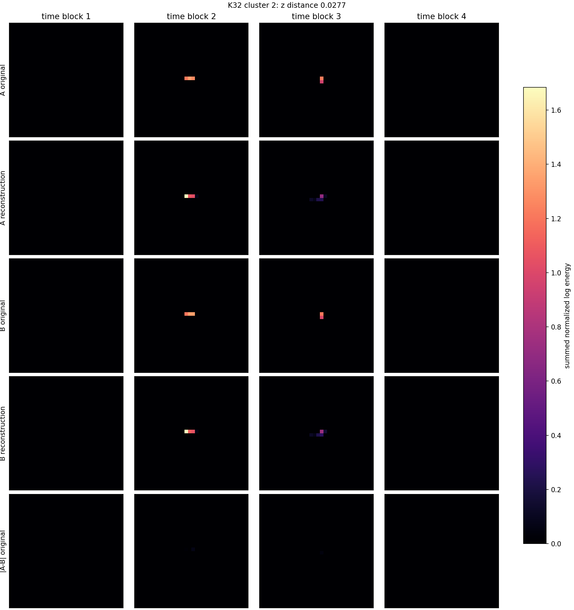


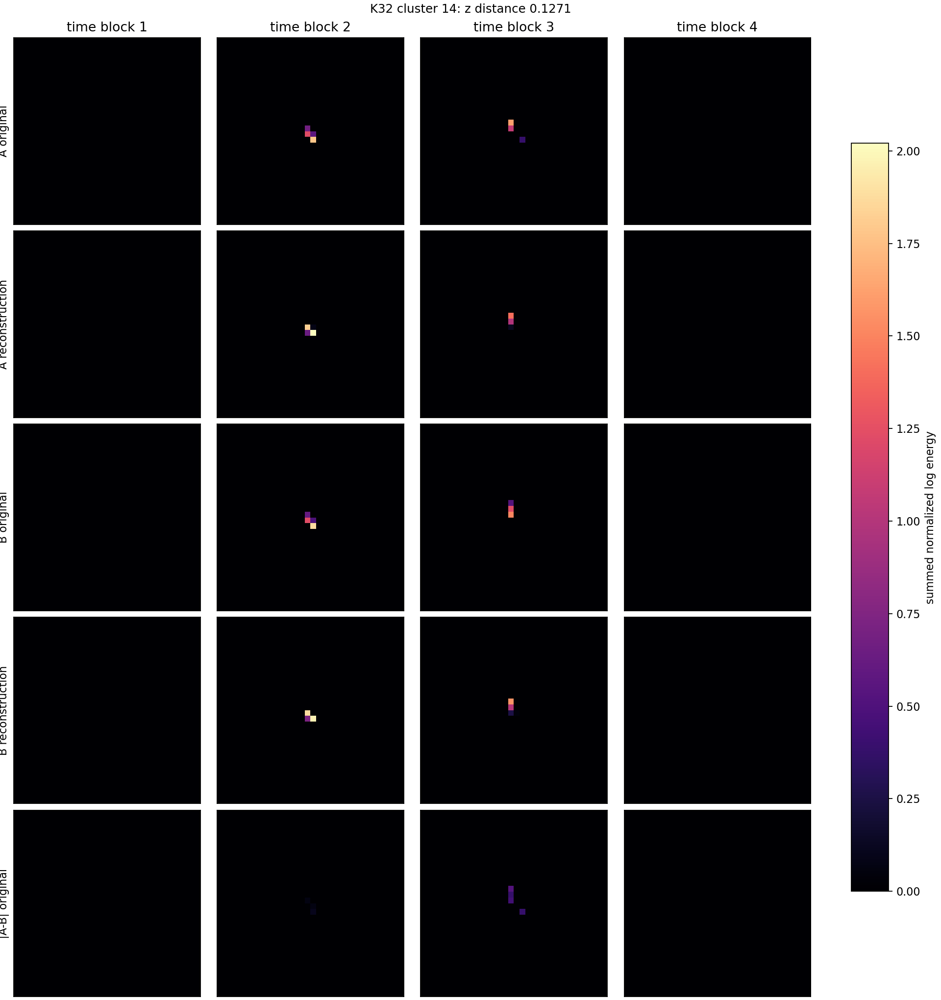

Pair table:

| Pair | K32 group | z distance | Hits A/B | Reconstruction L2 A/B | Original A-B rel L2 |
|---:|---:|---:|---:|---:|---:|
| 1 | 2 | 0.0277 | 10 / 10 | 0.407 / 0.403 | 0.031 |
| 2 | 11 | 0.0988 | 10 / 10 | 0.908 / 0.909 | 0.651 |
| 3 | 9 | 0.0383 | 12 / 12 | 0.548 / 0.548 | 0.023 |
| 4 | 1 | 0.0256 | 11 / 11 | 0.349 / 0.352 | 0.029 |
| 5 | 18 | 0.0391 | 21 / 21 | 0.423 / 0.413 | 0.023 |
| 6 | 15 | 0.0724 | 11 / 11 | 0.249 / 0.412 | 0.181 |
| 7 | 24 | 0.0758 | 19 / 17 | 0.286 / 0.271 | 0.203 |
| 8 | 14 | 0.1271 | 13 / 13 | 0.431 / 0.494 | 0.288 |

Notice the warning signal: some pairs are extremely close in latent space but still far in original tensor space. That is expected for a small 8D bottleneck and confirms that latent grouping is a browsing/compression tool, not an exact particle metric.

## Recommended Story For A Coworker

1. **We solved the separator bottleneck first.** The native 3D DBSCAN path is custom, exact, C/OpenMP accelerated, and real-time capable on the densest local files.
2. **We corrected time handling.** The correct timestamp is `ToA - FToA / 16`, which fixed the coarse-time visualization and helped retune DBSCAN.
3. **The current Phase I output is healthy enough for Phase II.** It processed all 711 files and produced 3.46M candidate particles.
4. **Phase II is exploratory.** The simple 8D voxel autoencoder gives a compact latent space and useful grouping, but reconstruction is not perfect.
5. **Rotation disentanglement remains open.** The path-based pose-separated AE shows the right design; the voxel transform head did not yet force `theta_xy` into the explicit transform variable.
6. **Grouping is not physical labeling yet.** KMeans groups organize latent morphology, but original tensor L2 diagnostics show overlap. Human/physics interpretation or truth labels are still needed.

## Suggested Next Work

- Keep `native-grid-dbscan` as the Phase I baseline.
- Build Phase II labels/families from inspected prototypes, not from raw KMeans IDs alone.
- For rotation-invariant classification, prefer the pose-separated contract:
  - compute `theta_xy`;
  - canonicalize XY;
  - encode canonical shape;
  - keep pose metadata outside the class embedding.
- For the voxel model, add explicit rotation supervision or augmentation if we want `theta_xy` to become a real transform variable.
- Add a small hand-labeled gold set for ambiguous crossings/overlaps and for naming discovered families.

## Reproduction Commands

Build Phase I particles:

```bash
OMP_NUM_THREADS=32 particle-build-particles \
  --input local_data/raw \
  --index data/raw_data_index.csv \
  --params configs/teachers/dbscan_phase1_native_eps5_v001.json \
  --out local_data/processed/particles_aligned_time_eps5_v001 \
  --backend native-grid-dbscan \
  --threads 32 \
  --skip-existing
```

Render final Phase I long-timespan gallery:

```bash
.venv/bin/python scripts/dbscan/render_long_timespan_particles.py \
  --manifest local_data/processed/particles_aligned_time_eps5_v001/manifest.csv \
  --assets experimental_notes/assets/native_grid_dbscan_aligned_time_eps5_long_timespan_particles \
  --report experimental_notes/dbscan/final_eps5/native-grid-dbscan-aligned-time-eps5-long-timespan-particles.md \
  --limit 8 \
  --time-scale 0.625
```

Render simple z8 latent grouping:

```bash
.venv/bin/python scripts/autoencoders/render_phase2_simple_latent_groups.py \
  --checkpoint local_data/experiments/phase2_simple_voxel_ae_z8_b1024_clean_fixedmine_20phase_v001/checkpoint.pt \
  --cache local_data/processed/phase2_voxel_energy_8x32x32_representative_v001 \
  --out experimental_notes/autoencoders/latent_analysis/phase2-simple-z8-latent-groups.md \
  --asset-dir experimental_notes/assets/phase2_simple_z8_latent_groups_v001 \
  --local-out local_data/experiments/phase2_simple_z8_latent_groups_v001 \
  --selected-k 32 \
  --device cuda
```

Render current similar-latent pair gallery:

```bash
.venv/bin/python scripts/autoencoders/render_phase2_coworker_latent_pair_gallery.py \
  --checkpoint local_data/experiments/phase2_simple_voxel_ae_z8_b1024_clean_fixedmine_20phase_v001/checkpoint.pt \
  --cache local_data/processed/phase2_voxel_energy_8x32x32_representative_v001 \
  --latent-npz local_data/experiments/phase2_simple_z8_latent_groups_v001/latents_and_groups_k32.npz \
  --group-summary local_data/experiments/phase2_simple_z8_latent_groups_v001/group_summary_k32.csv \
  --out experimental_notes/autoencoders/latent_analysis/phase2-coworker-similar-latent-pairs.md \
  --asset-dir experimental_notes/assets/phase2_coworker_similar_latent_pairs_v001 \
  --clusters 8 \
  --device cuda
```
